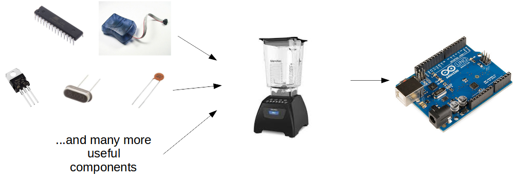

Arduino Uno
===

## What is a micro-controller?

Like a miniature computer, a micro-controller contains a processor, RAM, static storage, and other bits.  It can be programmed like any computer.

Unlike a normal CPU, a micro-controller provides direct electrical connections to external electronic devices, like actuators, lights, buzzers, sensors, a world of IC's, and more...  

Unfortunately, you can't connect it to a TV and play Minecraft like a normal PC.

## Development Boards

Basic micro-controllers can be a pain!

* They require a special device to program or flash them

* They need to be combined with external electronics like voltage regulators, oscilators, and capacitors in order to work properly

A development board like the Arduino Uno combines all of these elements on one PCB to create a device that is ready for prototyping and can be simply flashed using a simple USB Serial connection.

