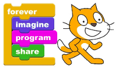
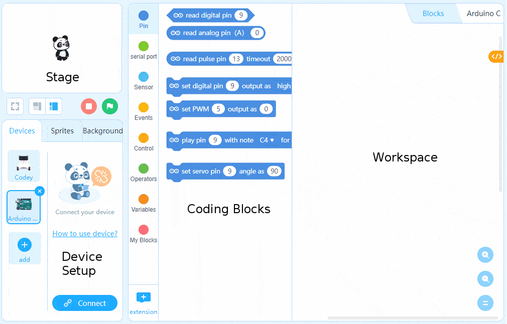
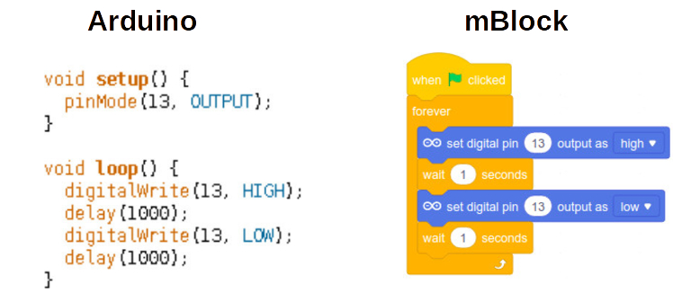

mBlock Basics
===

## What is mBlock?

If you've already worked on a block-based programming platform like MIT's Scratch or Blockly, you'd be comfortable with mBlock as a general Integradetd Development Environment (IDE).

The mBlock 5 version was developed on top of the popular Scratch 3.0, so would feel very familiar to those who've used that before.

## Main Parts

Lik Scratch, the mBlock IDE consists of a Stage (where Sprites are animated), pre-defined Coding Block tabs, the Workspace (where you write code), and tabs for creating and defining Sprites & Backgrounds.

However, mBlock has a unique tab in the lower left corner for defining external "Devices" and setting up connections and communications with those devices.
 
 

When you are highlighting a Device rather than a Sprite your code blocks will change to reflect the type of operations you can perform on the Device, which are unique to each Device and quite different from what a Sprite can do (mostly animations confined to the Stage area).

## Why mBlock and not Arduino's own IDE?

Arduino's platform was initially created with a retooling of an IDE called [Processing](http://processing.org).  It uses the coding language bindings of C/C++, and is a more suitable approach for end products, especially if there is any reliance on low-level manipulation of the board's environment (tweaking clock speeds, creating interrupts, etc).

Learning C/C++ would be great, but takes longer and is unnecessary for this course and the types of projects we will be covering.  mBlock also has the benefit of providing a link between the Arduino and the Stage of Sprites, which can make it easy and fun to make interactive products.

Here's a comparison of C/C++ with an mBlock block-based program:

Writing text-based code can be more efficient than block-based programming when you get good at it, but block-based programming is better for a fast-paced course like this!
