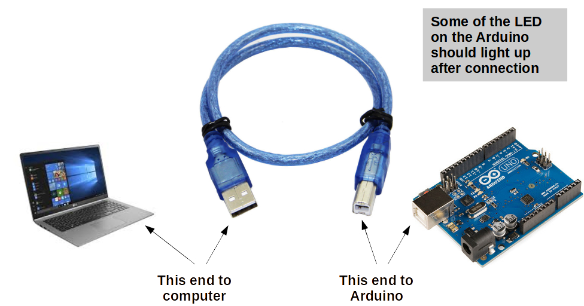
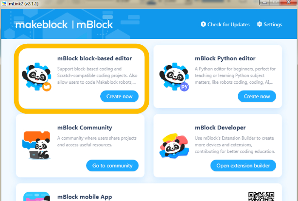
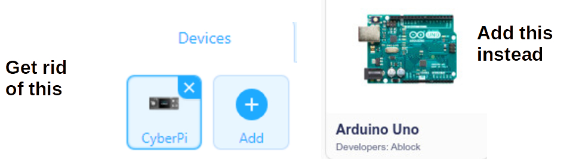
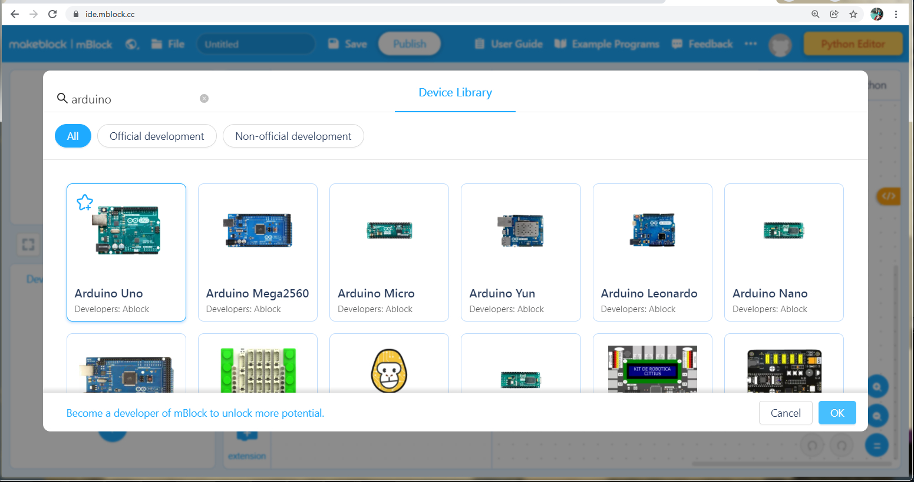
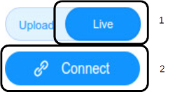
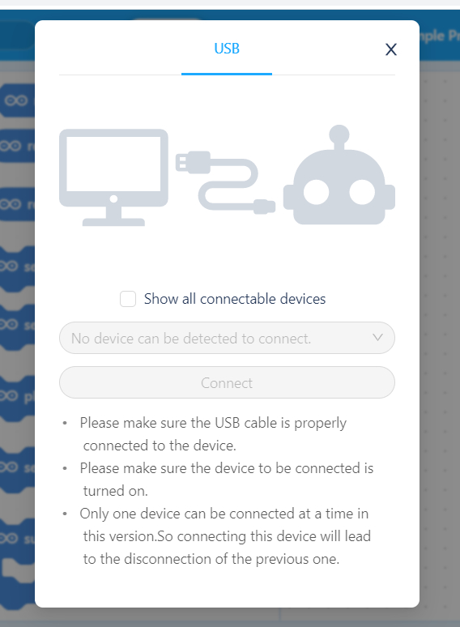
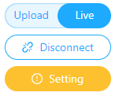

Basic Setup
===

The following are general steps you'll need to follow to connect your Arduino Uno and mBlock to create your working development environment.

## Physical Connection

Start by connecting the Arduino Uno to your PC/Laptop using the USB Serial cable.  The Arduino's power LED should light up, and you may see the LED labeled as "L" blink rapidly and possibly continue to stay on as well. 

## Using mBlock in the Browser (mLink)

If you need to use mBlock from a browser, you will need to run a piece of software in the background, which supports translating commands from the browser to the Serial connection.  

This software is called mLink and you should find it and start it on your PC/Laptop.  Its icon should look like this:
 
 

If your PC/Laptop doesn't have it installed, you can find it [here](https://mblock.makeblock.com/en-us/download/mlink/).

And if you are using mBlock the app on your PC/Laptop, you will not need the separate mLink software at all.

## Start the mBlock IDE - http://ide.mblock.cc

From a modern browser (preferably Chrome), you can load the above [URL](http://ide.mbock.cc).

If you have mLink up, you can also click on the "Create now" button as shown below, but note that it will load the IDE on the default browser, which might not be Chrome or the one you'd prefer.

If you're using a local mBlock app, just start it up as any other.
 
 

## Setup Arduino Uno as Device

In the version of mBlock as-of writing, the default Device loaded in the IDE is CyberPi.  We want Arduino Uno, so let's remove(x) CyberPi, and Add(+) Arduino Uno instead. 

Make sure you get Arduino Uno with **Developers: Ablock**

## Connect to Arduino Uno

Now it's time to establish that Serial connection between mBlock and Arduino Uno.

NOTE: There's a difference between *Upload* and *Live* mode, which we will discuss later, but until further notice, make sure to **use Live mode always**.

Toggle the mode to Live, and press Connect.

You will see a connection dialog like this:

If you see a **COM<NN> Port** listed in the dropdown, and the *Connect* label is not greyed out, you can press *Connect* and see if that was successful.  It is possible you may need to change to a different COM Port if more than one is listed in the drop-down.

If there are not COM ports listed, the try checking the *Show all connectable devices* checkbox, and see if you get a COM port listed then.  If so, click *Connect*.

If you're still not geeing a COM port listed, make sure your Arduino is properly connected with the USB cable to your PC/Laptop, or ask for help.

## Settings / Firmware Update

You are almost done, once the Arduino Uno establishes a connection the *Connect* button turns into a *Disconnect* button, and you shoudl also see a new *Setting* button below that.

If this is the first time you are using teh Arduino Uno in *Live mode* you will need to download some code into the Arduino to behave in this synchronous style.

You will know if you need to update the Arduino by looking at the *Setting* button.  If it is Yellow/Orange and shows a warning/exclamation sign, you need to update.  Click the colored *Setting* button and follow the instructions.

After than please click *Connect* to re-connect to the Arduino, and you should be all set (*Setting* will have a clear/white background).