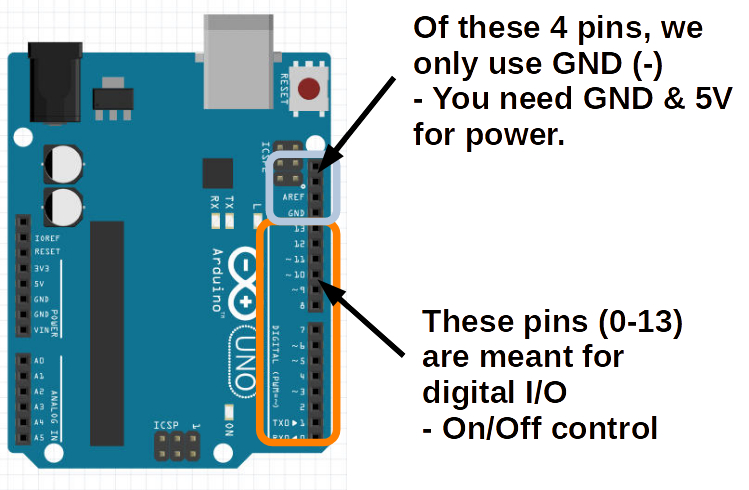
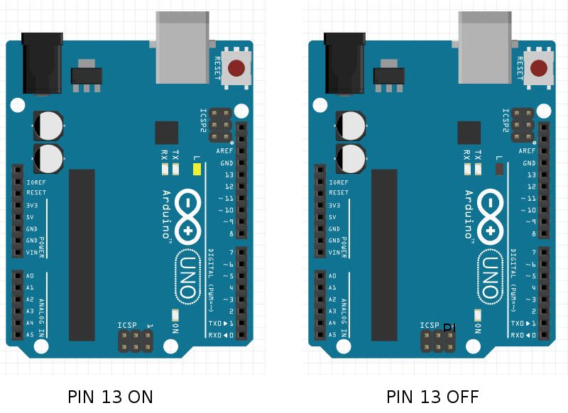
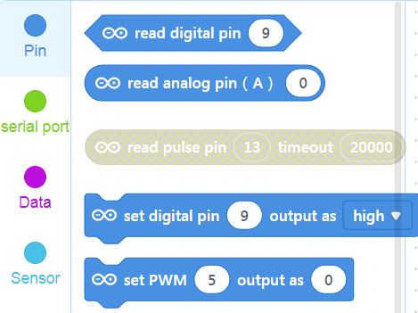
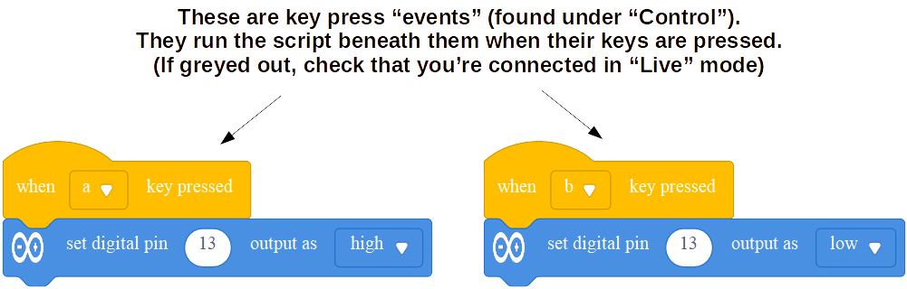

Blink
===

## Arduino Blink

The first program you learn to write for Arduino is usually Blink - it's the "Hello World" of the Arduino platform.  Blink code makes the internal LED (marked "L") on the Arduino blink on/off.

Let's start by understanding some of the pinout on the Arduino Uno board - refer to this image:

The 13 pinholes on the right starting from the bottom represent 13 digital input/output's.  That means each of those is connected to an internal pin that can either:
* Output ON (5V) or OFF (0V or GND) signal to toggle some external circuit
* Input ON (+V) or OFF (0V or GND) signal to read from some external device

We are going to look at some examples of such external circuits shortly, but for now, we just want to toggle the internal LED (marked "L") near the top right of the Arduino.

It just so happens that **this built-in LED is internally connected to digital I/O PIN 13**.

Therefore, when PIN 13 is set to ON/TRUE/HIGH the LED will turn on.
And when PIN13 is set to OFF/FALSE/LOW the LED will turn on.

ON/OFF, TRUE/FALSE, and HIGH/LOW are just three different designations you can use to describe the state of these digital I/O pins.

## Sample Code for Toggling Pins

Our program then needs to toggle the state of PIN 13.

Let's look at the mBlock coding blocks for the Arduino Device.

The first two start with *read...* - that means they assume the pin in question is an INPUT.  We want to treat PIN 13 as an OUTPUT.

NOTE Greyed out blocks are usually meant for the other mode (Upload), so *"read pulse pin"* can only be used if we switch mode.

*set digital pin (\_\_) output as [\_\_]* - that looks like a promising block.

Let's drag one onto our Workspace, change the Pin field to 13, and the High/Low dropdown to High.  If your Arduino is *Connected*, just click the set pin block, and you should see the "L"-labelled LED is lit.

Duplicate or drag a second *set digital pin* block with the same pin 13, but this time set to **Low**.  Now click on this block and the LED shoudl turn off.

Similarly, we can attach Events like *When Key Pressed* to create a manual light switch for our built-in LED:

