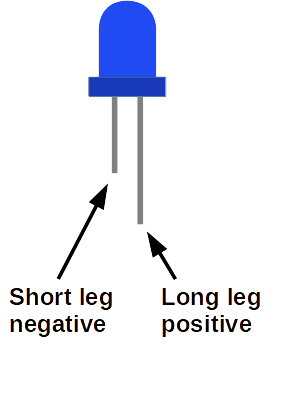
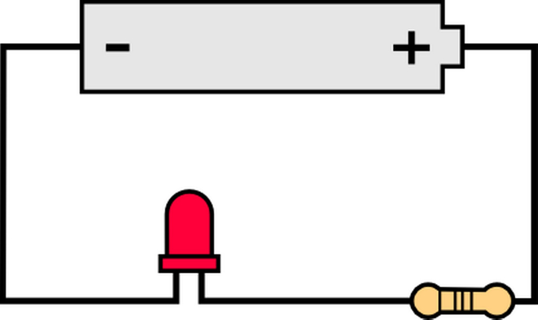
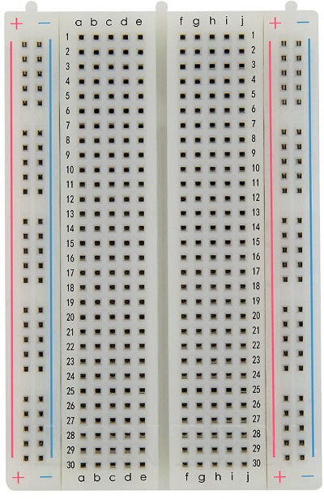
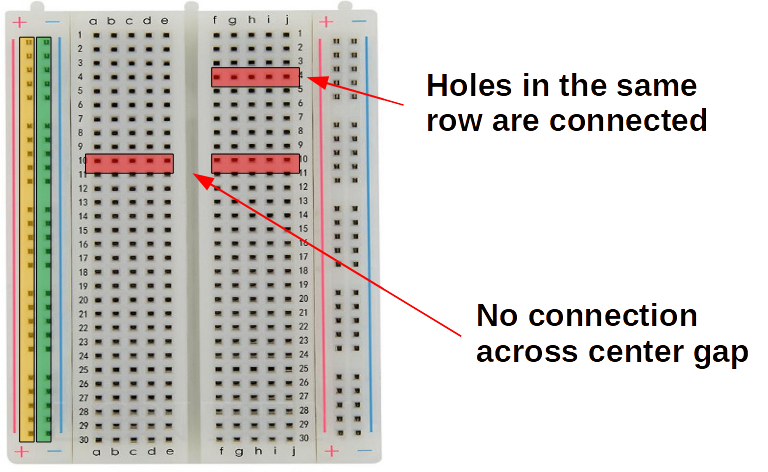
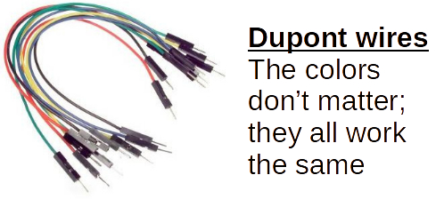
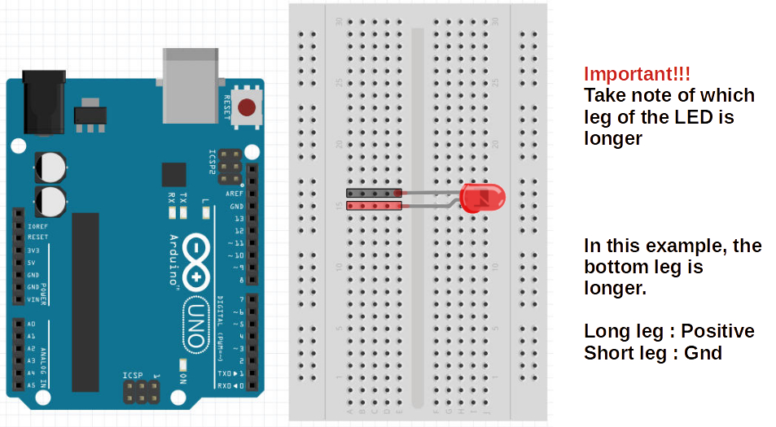
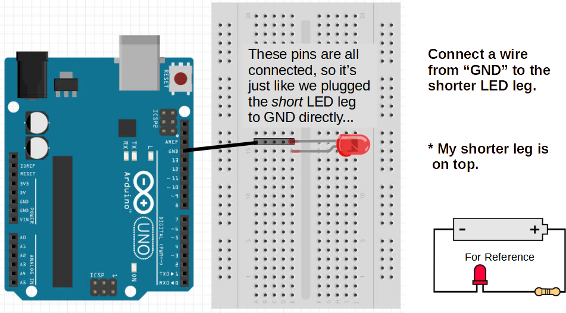
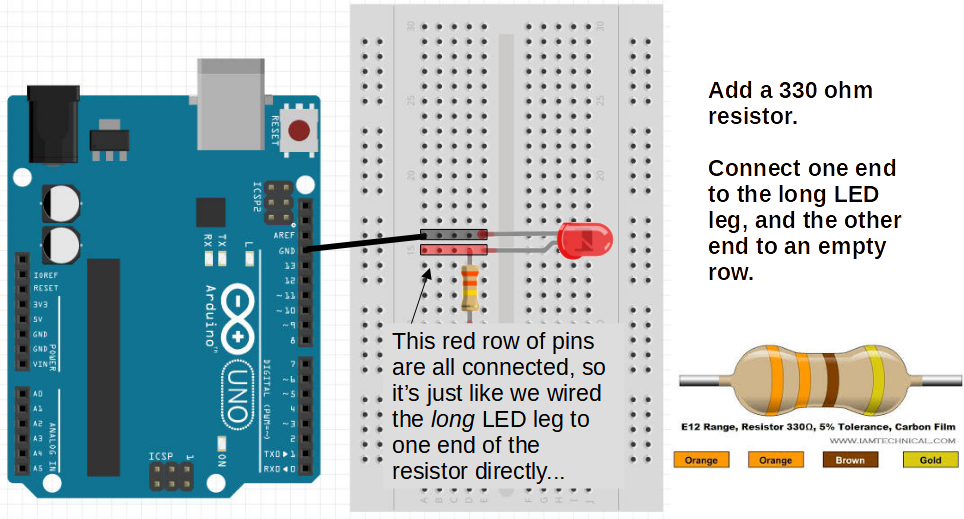
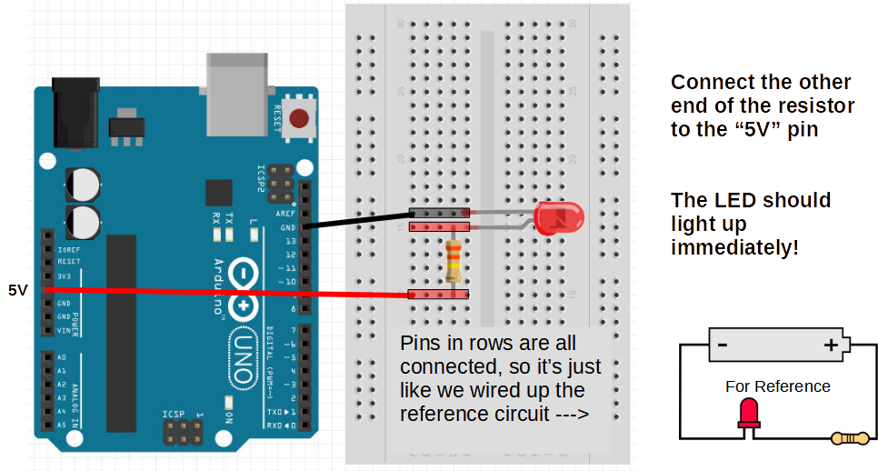
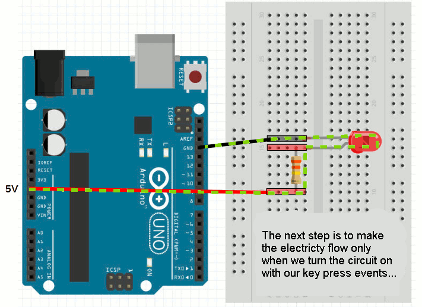

External LED
===

A [Light-Emitting Diode (LED)](https://en.wikipedia.org/wiki/LED) is a simple semiconductor that glows when enough current passes through it.  Depending on the semiconductor material, the LED may glow blue, red, yellow, green, and so forth...

A diode allows electrical current to pass through it in only one direction, so an LED is similarly polarized.  

Note that external LEDs have wires/legs sticking out of the bulb.  The short leg connects back to the Negative(-) or GND side of the power source, while the long leg should be connected to the Positive(+) side:

Here is a simple LED circuit showing a power source (battery), and an LED:
 
 

Question: Which leg sticks out in which direction?

## Resistor

There is a third component required in the simple LED circuit as shown above.  That last component is called a [Resistor](https://en.wikipedia.org/wiki/Resistor), and its job in this example is to resist or reduce electrical current flowing into the LED.

LED's, like most electrical components, are finnicky about how much electricity should flow through them, a little bit like Goldilocks.

Too little current, and the LED is either too dim or completely shut off.  Too much currect and the LED burns out and is forever destroyed... So, we should err on the too little side of this dillema.

Different color LEDs require different voltages:

<table>
<tr><td>Red, Yellow, Infra-red</td><td>1.8V</td></tr>
<tr><td>Blue, White, UV</td><td>3.3V</td></tr>
<tr><td>Green</td><td>Depends. Try 1.8V first</td></tr>
</table>

Arduino pins provide 5V.

The resistor helps to reduce the voltage, and the current it creates.

Question: What happens when you connect 5V to a Red LED without a resistor?

# Breadboard

We will be using the Arduino Uno itself as the power source for our external LED.  So find an LED and a resistor in your kit.  Now in order to connect these components as shown in the above simple circuit diagram, you'd need some way to hold the wires/legs asainst each other and stick some of them into the Arduino pin holes.  

Holding all of these together in your fingers is a pain.

[Soldering](https://en.wikipedia.org/wiki/Soldering) is one way we can connect these togther, but that's too permanent for the kind of prototyping we are doing, so we are going to use a [Breadboard](https://en.wikipedia.org/wiki/breadboard) to connect many of the circuits in this tutorial.

In this kind of breadboard, the long columns marked (+) and (-) on the sides are connected.  That means all the pin holes on the (+) column are connected internally.  Putting the end of one component in one of the (+) column holes, and putting another component in another of the (+) column holes is the same as holding those two wire ends/legs together.  The two (+) columns on either side are not connected to each ther.  Similarly for the (-) columns.

Every mini row is internally connected as well.  For instance, all the five pins in row 10 marked with columns *abcde* are all connected. Also all the row 4 pins with columns *fghij* are internally connected.  The big line in the middle separates rows on either side of that divide.  So 10a is not connected to 10f and so on.

## Jumper Wires

Jumper wires are used to connect various components on the breadboard, and to external pin holes on the Arduino Uno itself.

## Connecting the Simple Arduino LED Circuit

With the Arduino Uno, the breadboard, jumper wires, an external LED, and a resistor, we can now try to create the simple LED circuit.

### 1) Place LED into two unconnected breadboard rows:

### 2) Connect the short leg of the LED to the GND/- pin on the Arduino (there are actually 3 of them, so either one is fine):

### 3) Connect one leg of the resistor to the row with the long LED leg.  The other leg can go to any other unused row on the breadboard.

### 4) Finally, connect a jumper wire from the row with the second resistor leg to the (+/5V) pin hole on the Arduino:

## Elecricity Flow

The current will flow from Arduino GND into the LED short leg, then through the semiconductor where it will cause the material to glow, then out the long leg, through the resistor and into the +/5V lead of the Arduino.

The resistor just needs to be in the cirtcuit to make sure current is regulated and not freely flowing into the LED's semiconductor and burning it up with too much excitation.

