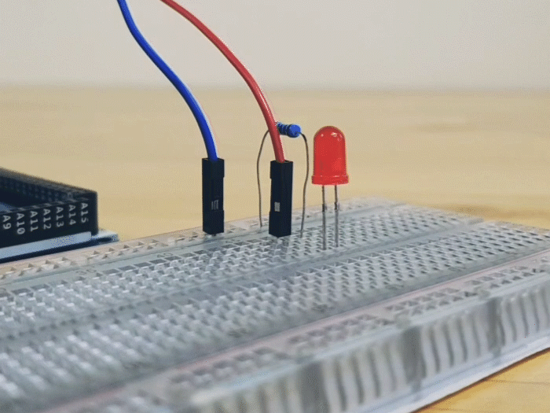

Challenge 1b
===

At this point the LED is always on, because it's connected to the +/5V pin of the Arduino.  That pin is always "ON".

If we want the external LED to blink, we need to connect it to one of the 13 programmable digital I/O pins.

If you completed Challenge 1a, then you can just change the wire from the resistor to connect to PIN 13 instead of +/5V.

Pin 13 is already being turned on/off in your program, because that's how you control the internal built-in LED as well.

When PIN 13 is ON/HIGH it is acting like a +/5V pin, so electricty can flow from GND through the LED into this programmable pin.

When PIN 13 is OFF/LOW it is active like a -/GND/0V pin, so electricty has no where to go to.  Electricty moves through a [voltage](https://en.wikipedia.org/wiki/Voltage) gradient from - to +, but if the endpoints of the circuit have equal potential (both 0V/GND) then there is no voltage gradient to carry the current.

You can also connect your external LED to one of the other pins, and change your program to control that pin instead...

NOTE: You can change the rate of blinking by changing the duration of your *Wait* blocks.