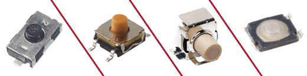
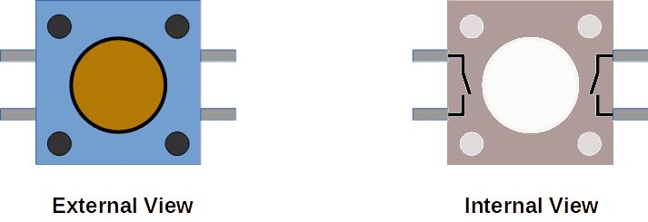
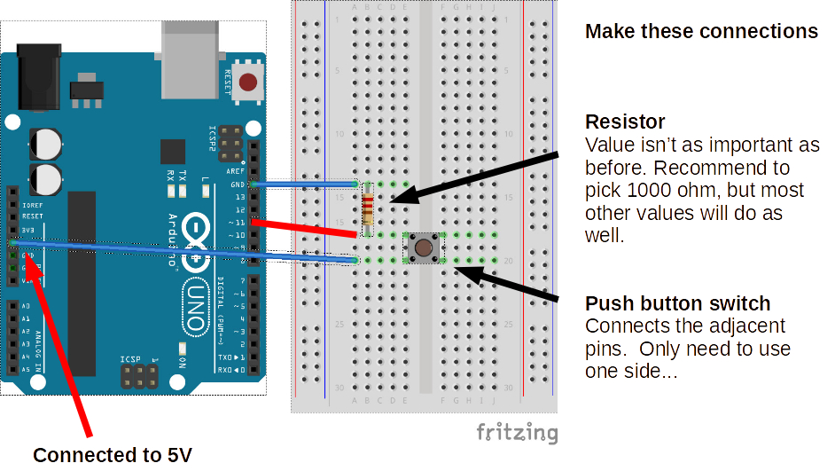
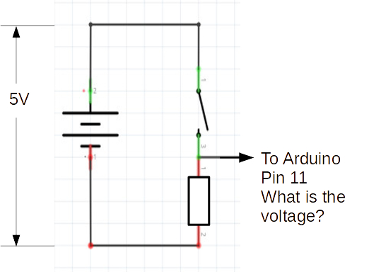
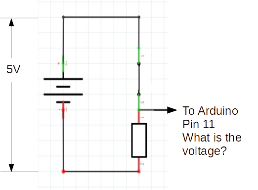
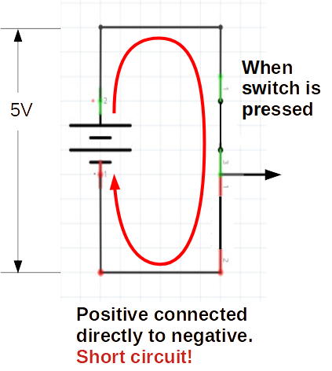

Digital Input
===

We've seen how to use a simple, digital output pin to toggle an LED circuit ON/oFF.

Now let's look at reading in a digital input.  The simplest version of this would be an ON/OFF push-button (ON while pushed).

## Push-Button

Here are external and internal views of a simple breadboard-friendly push-button:

## Connecting a Push-Button or Switch

Get your Arduino, breadboard, jump wires, resistor, and push-button:

NOTE: The red connection from the switch to Arduino is via **digital I/O PIN 11**

## State of Circuit and PIN 11

Open Circuit, PIN 11 only connects to the resistor which pulls down to **0V** from the Arduino's GND pin.  The resistor in this state is called a **pull-down resistor**.

1000 or 1k ohms is a good rule-of-thumb value for this circuit, but any resistor would do in this simplified case.

So in this configuration of the circuit (button is released) PIN 11 would read as OFF/LOW/FALSE.

## Pushing the Button and PIN 11

When you push the button you close the internal switch circuit and now PIN 11 is seeing the 5V connected to it directly.  Since there is no resistor, it is happy to accept the electricty flowing freely from the open pin over the more resistor-regulated GND pin...

So in this configuration of the circuit (button is pressed) PIN 11 would read as ON/HIGH/TRUE.

## Significance of Pull-Down Resistor

Without the pull-down resistor (imagine directly wiring the same switch contact to 5V and GND), the closed circuit state would result in a **Short Circult**.  THis is dangerous for electronics, and would cause the Arduino to go into a defensive safe state (shut off).

