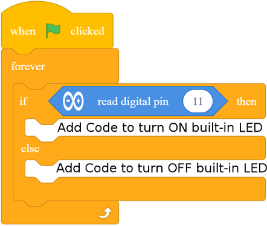
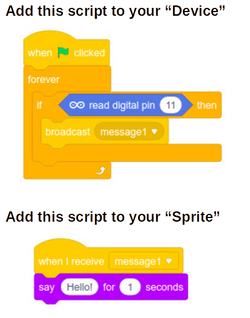

Challenge 1c
===

Add code like this to continuously read the state of the push-button by reading thh state of PIN 11.

Pushing the button should control the built-in or an external LED if you have it wired up.

## Broadcast

We can use the Broadcast block to let our Sprites on the Stage know that an event has taken place in the Arduino Device.

In this challenge you need to add code to both the Device Workspace, as well as a Sprite's (panda, by default) Workspace.

See how pressing the physical button is making Panda talk...