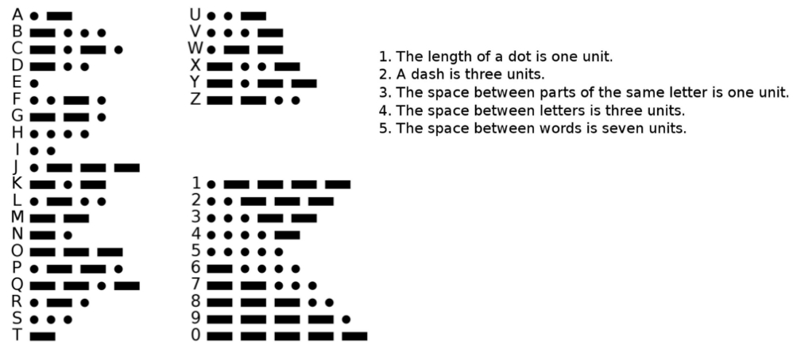

Extra Challenges
===

## 1d Morse Code

Write code that connects different key press events to those keys' morse code - as blinked by the built-in or external LEDs.

## 1e Panda Joystick

Wire two(2) separate push-buttons each to its own digital I/O pin. 

Make Panda move Left when pushing Button 1, and move Right when Pushing Button 2

# 1f LED Toggle Switch

For this challenge you need to connect an LED and a Button input to the Arduino.

Make the LED toggle between on and off when the button is pressed - LED stays on when toggled on, even after you release button…

Hints: You will need to save the state of the LED in a **variable**, then check the state each time you press the button, and change state – use the state to determine what to do about the LED pin