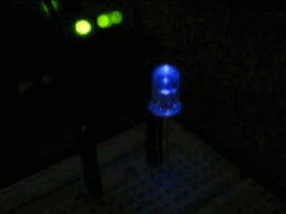

Dimmer Effect
===

## Analog Output

Let's improve the Basic LED project by introducing dimmer effect:

Note that the LED is not turning on and shutting off instantly, but rather slowly getting brighter and then dimming out.

Digital Signals:
* Low vs. High
* False vs. True
* 0V or 5V

These are binary discrete states.

Analog Signals:

* A range of possible discrete values (e.g. 0-5V)

 
We need an Analog output signal to drive a dimmer effect through the LED.
 

----

## Analog I/O on Arduino

Let's take a look at the Arduino board:

Note that the bottom left area is for Analog **inputs**.  It's not obvious where the Arduino can send out an Analog **output** signal, like the one we'd need to make an LED dimmer effect.

So, how can we control brightness on the LED?

* Change the resistor in the circuit?
* Vary the amount of power we send out through the **Digital Outputs** - but how???

---

## Pulse Width Modulation (PWM)

**PWM** is an efficient method to vary and control power.

It is wsed in various electrical systems:
* Lights
* Motors
* Communications
* Others

We can only On/Off or HIGH/LOW or 5V/0V the digital outputs.

But, what if we wanted %50 power?

* Can’t set digital output to 2.5V….
* So, we add **Time** to our signal!
---
## Making a PWM digital signal:
* Let's pick some tiny Interval or Period (say 1 ms, or 1000 Hz)
* Set signal to HIGH ½ of the Period (0.5 ms ON)
* Set signal to LOW rest of the period (0.5 ms OFF) 
* Run signal over and over...

This is a **%50 Duty Cycle**.

How about other duty cycles?  %25?  %75?  %96?

So, at %25 PWM output, the LED should be ~1/4 as bright as when it's on %100 PWM (simple digital ON), and so on...

NOTE: The reason it looks dim rather than just blinking is because the duty cycle period we chose was 1ms.  If we choose something bigger, on the order of 33ms or 30Hz - that is closer to what our eyes can distinguish as different states... 30 Frames Per Second sounds familiar?

Normally the duty cycle for PWM is on the order of tens of micro-seconds or 100,000Hz. 