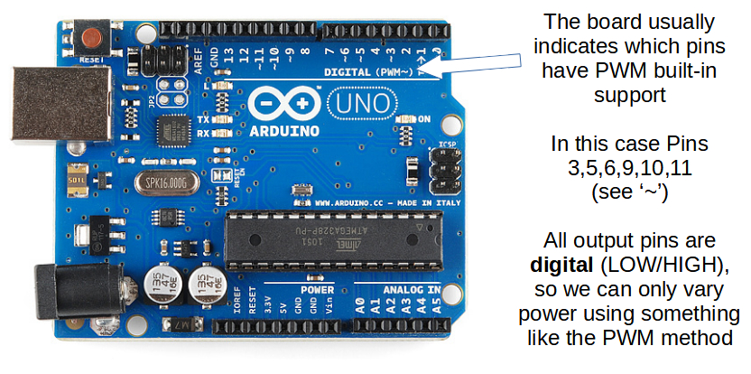
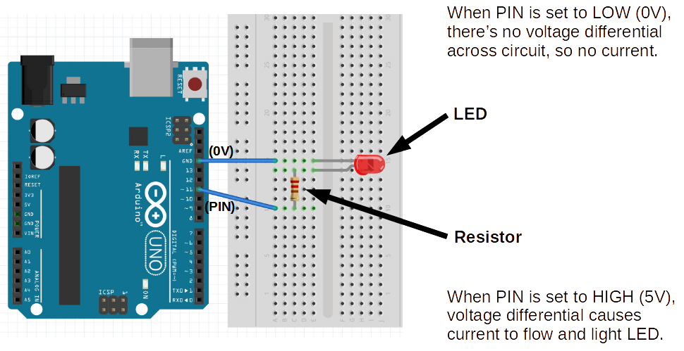
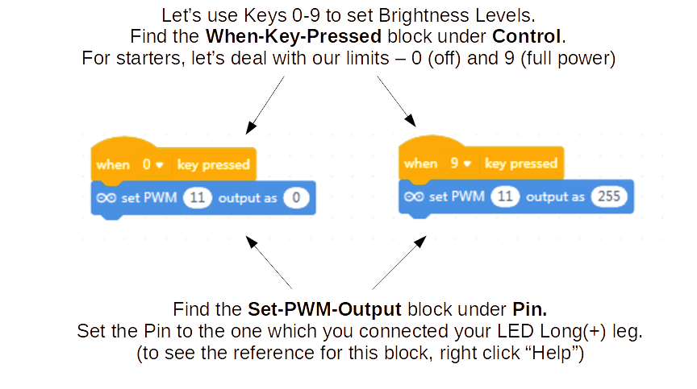
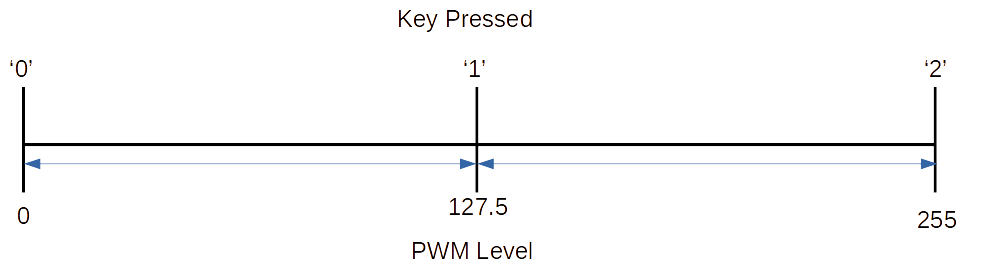
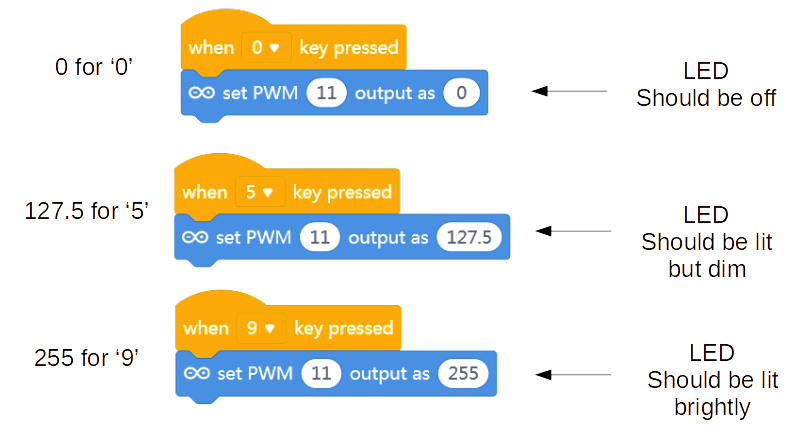

Setting Analog PWM
===

## PWM I/O Pins

We are going to work with Pulse Width Modulation (PWM)  

Take note which pins support PWM on the Arduino Uno:

## Re-wire LED Circuit

Let's review the LED wiring once again, as we will need an external LED to play dimmer effects on.

## Code Levels of LED Brightness

**255 is the max value** for PWM or Analog Output

Why 255? 

It has to do with how numbers are stored in binary formats in a computer memory.

If we store a number in 8-bits of memory we can represent 256 discrete integers: 0-255

## Add more Brightness Levels

Say we wanted 3 levels:

* OFF
* %50 bright
* %100 ON

What would the code for the extra brightness level look like?

