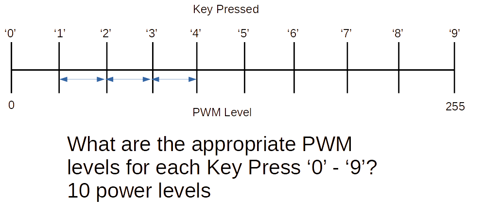

Challenge 2a
===

## Use all 0-9 keys for 10 Brightness Levels 
 

## Add code to control LED brightness using all ten (0-9) keys!

 

NOTE: Make sure the step between 1->2 is the same as the step from 3->4...

