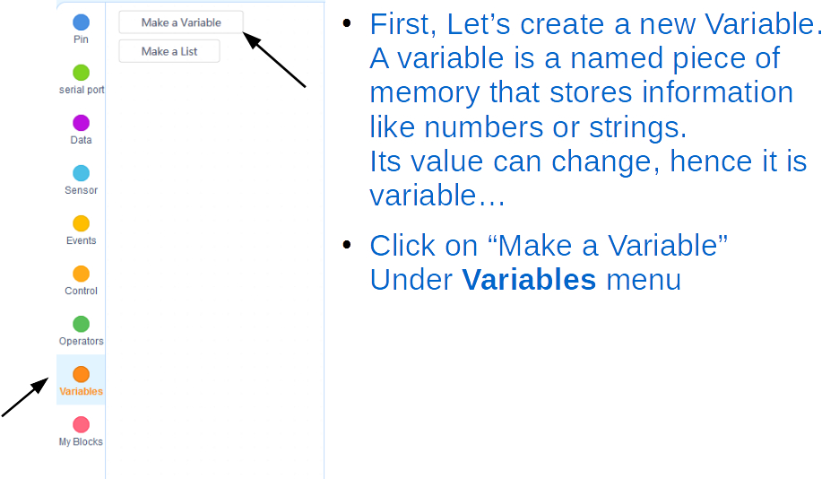
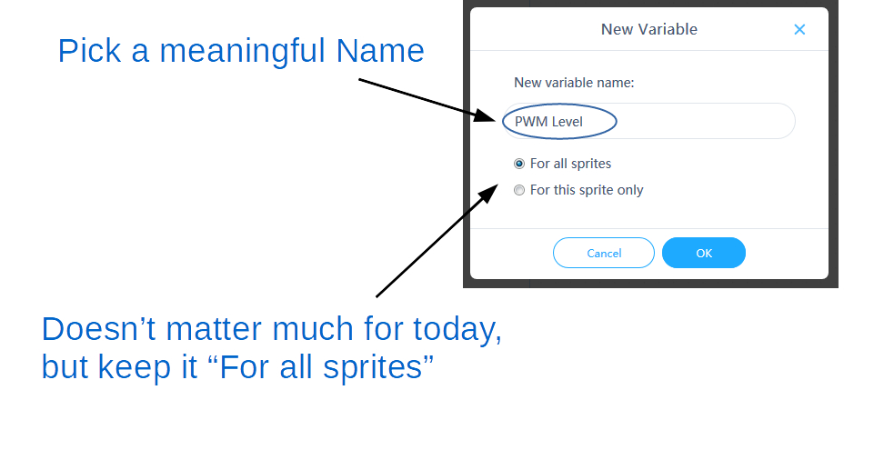
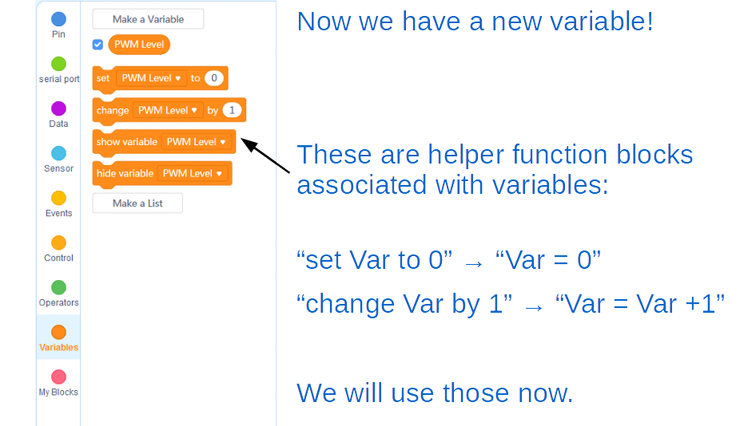
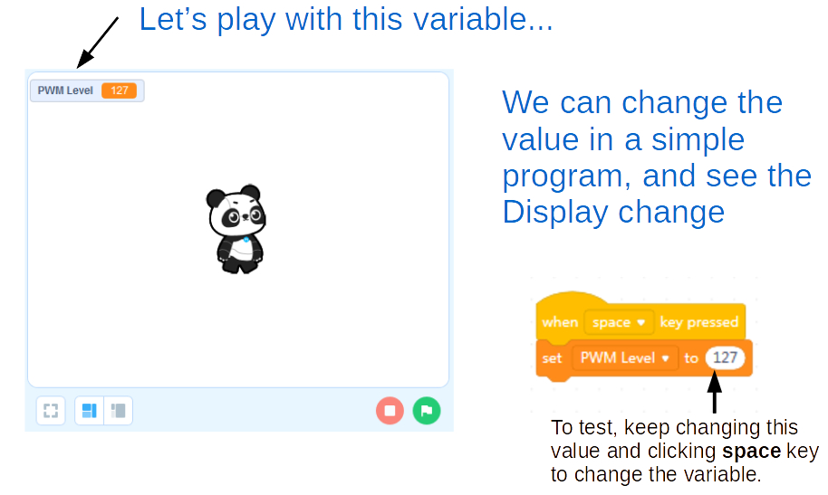
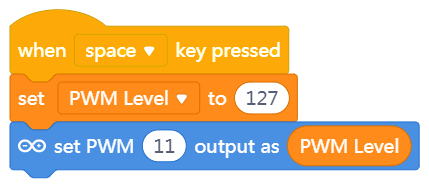
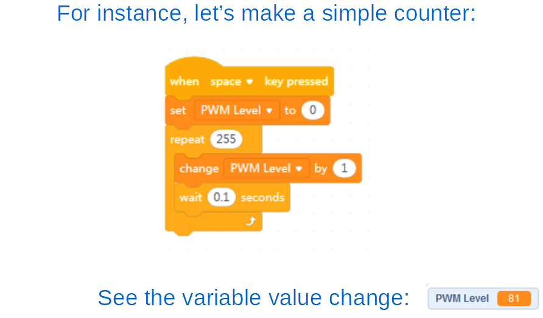
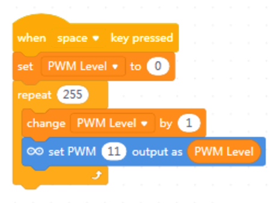

Smoothing the Effect
===

## More Brightness Levels, Please! 

With 10 keys controling brightness levels progressivley you can run up and down the keyboard like a piano simulating a dimmer effect.

If we want a smoother dimmer effect we need to run PWM through the LED at many more PWM levels (all integers 0-255)

But we don’t have enough keys or patience to code and press all of them, so let’s try more coding...

## Creating Your First Variable
 

---
## Changing the Variable
 

We want to use the value in our program to change the PWM output of our LED pin.

We can use the Variable itself in the *Level* bubble in the *Set PWM Output* block.

## Dimmer Effect - Loops

So how does this help us achieve the dimmer effect?

We wanted some way to progressively set the PWM levels from 0 to 255...

Think about how we can change that PWM level variable by 1 step in a loop?

Now let's set the actual PWM level in the LED pin to these levels in the loop!  Replace the *Wait* block with the *set PWM output* block:

The *set PWM output* function already blocks for a split second, so we don't need to worry about the *Wait* block anymore...

