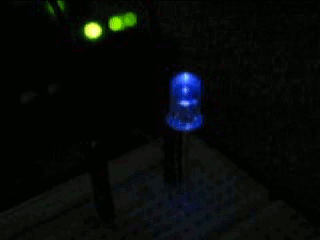
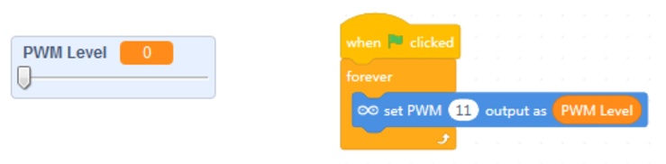

Challenge 2b
===

<ul><li>Use the sample program at the end of the last session, but vary the step size.  See which step size gives you the best dimming effect.</li><ul>
<li>You can also add <i>Wait</i> times</li>
</ul>
</ul>

<ul>
<li>The simple program runs the dimmer effect forward, and then the light abruptly shuts off.  So, extend the program to run the dimmer effect <b>in reverse</b> as well.  
</li>
</ul>

<ul>
<li>Make the dimming effect pulsate contiuously like this:
</ul>

Another simple way to get this done is by using a graphical slider.  Just change the variable's UI mode on the mBlock Stage.

