Analog Input
===

We used **Analog Output** with PWM signals to create a dimming effect in external LEDs.  

Now we are going to figure out how to accept **Analog Input**.  

That means we need to be able to accept a range of values, not just ON or OFF.

In Challenge 2b we showed how to make a UI Analog Input.

So, how do we create something like an exetrnal electronic slider?

And how does the Arduino reaqd in that input?

## The Potentiometer

We will be using a **Potentiometer** as a variable resistor, or Rheostat, to model the slider physically.

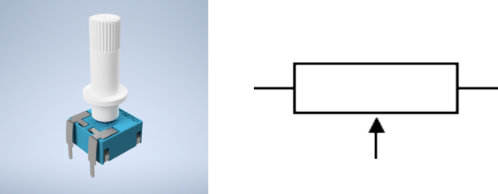

## Electrical Resistance Revisited

To get a feel for what is a [potentiometer](https://en.wikipedia.org/wiki/Potentiometer), or variable resistor, we should revisit the notion of electrical resistance.  

We've discussed it briefly when looking at the LED basic circuit, where we used a resistor to limit the amount of current flowing through the connected LED - to make sure it doesn't burn out.

**Resistance** - a measure of the difficulty to pass an electric current through a circuit element.

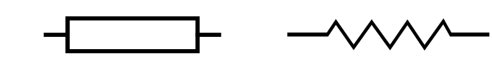

**Fixed** resistors have fixed (non-changing) resistance:

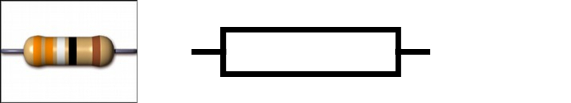

**Variable** resistors have changeable resistance: 

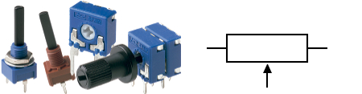

## How a Potentiometer works

Inside a variable resistor there's usually a fixed resistor and a *wiper* that points between the minimum and maximum terminals of the resistor.  Depending on where you're pointing the wiper, the resistance between one of the end terminals and that wiper will be determined.  

As you change the wiper, so does the resistance between it and the end terminal is varied.

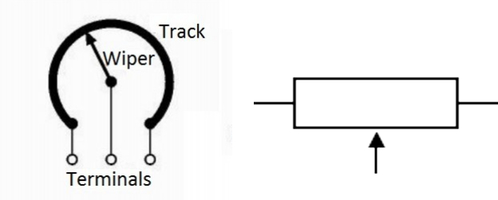

## Measuring Resistance in a Potentiometer

Resistance is measured in **&Omega; (ohms)**.

We can use a multimeter to measure the resistance between one end terminal and the wiper of a potentiometer.

## BUT! Arduino Analog Input Doesn't Read &Omega;...

If we examine the Arduino's Analog Input documentation, we would find that the pin holes in question do not really read Ohms (&Omega;)... 

Analog Inputs in microcontrollers utilize Analog-to-Digital Converters (ADCs), which read in *signals*.  Signals require electricty to flow through, not inert resistance on its own...

We can create a variable signal by connecting the end terminals of the potentiometer to the Arduino's power source (GND & +5V).

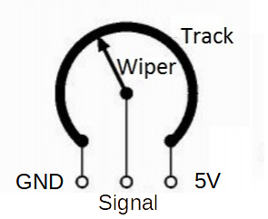

The wiper creates a voltage divider, meaning some of the voltage will go to one side of the potentiometer, and the rest will go to the other.

If the wiper is in the middle, both sides are getting half or 2.5V.  

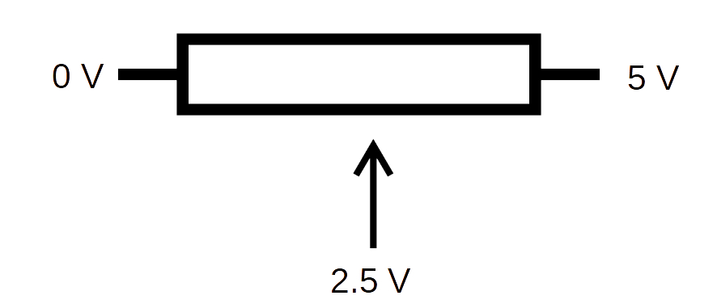

If we reconnect our multimeter but this time read the voltage as a signal between the GND/MIN terminal and the wiper, we can see how the voltage can be varied from 0-5V.

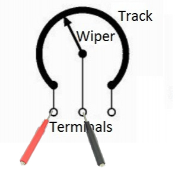

---
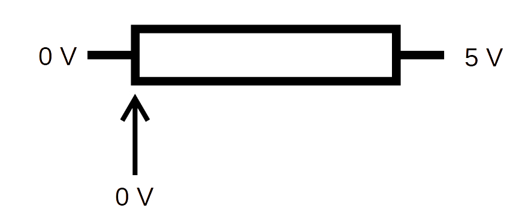

---
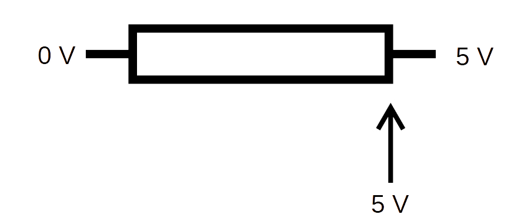

---
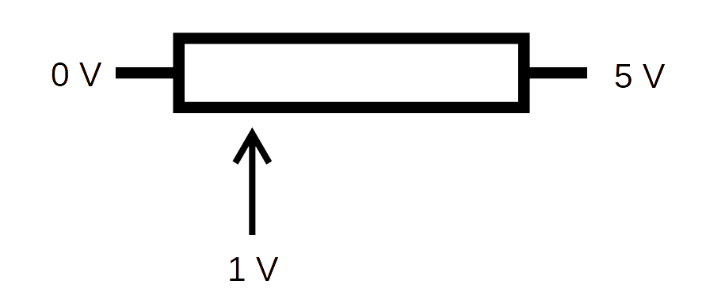
