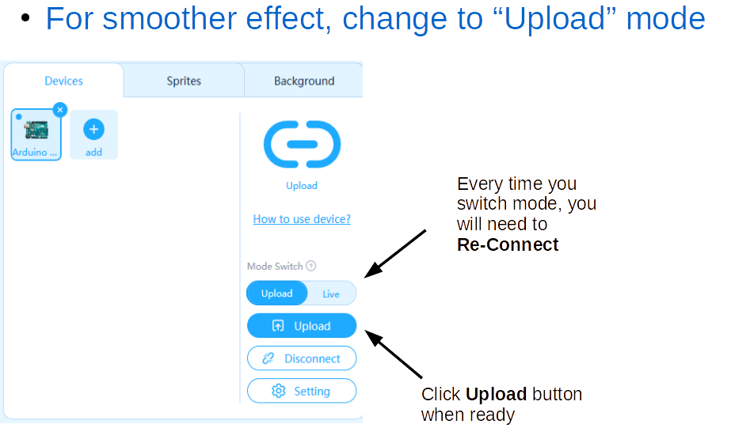
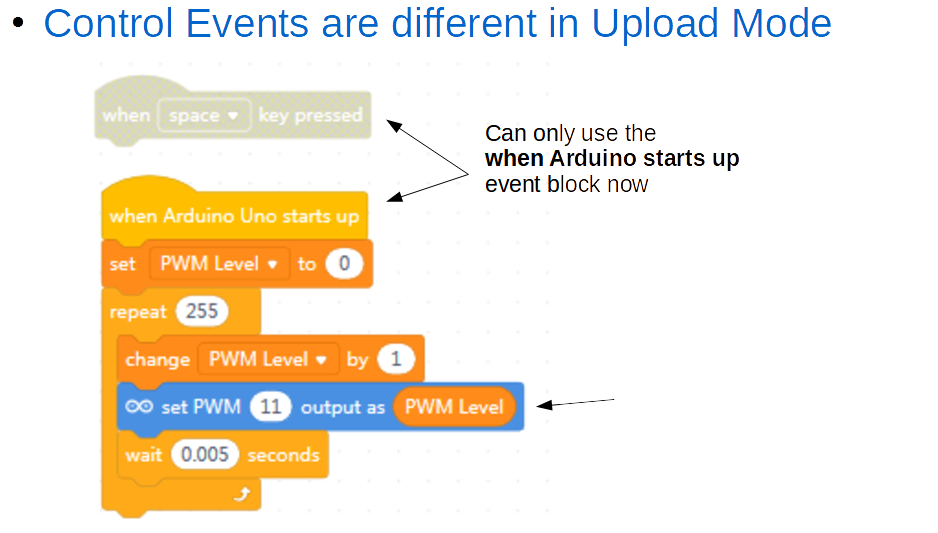
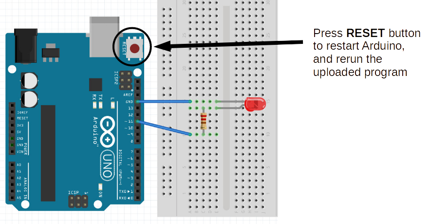

Extra Challenges
===

## 2c Upload Mode

NOTE: If you want to change back to *"Live Mode"* after using *"Upload Mode"* you will need to also reset the frimware - click the *Setting* button and follow instructions.

## 2d Slider

Back to *"Live Mode"* convert your variable to a Slider and use it as a graphical Variable Dimmer Switch

## 2e UI Dashboard

Create a Graphical Dashboard to control Lights (on/off buttons, slider dimmers, blink buttons)

## 2f Toggle Dimmer

Use a physical button to act as a Toggle Dimmer Switch (on/off)

## 2g Light Show

Use multiple LEDs to create a Light Show with blinking, dimming, and any other effects you can muster!
(probably works best with *"Upload Mode"*)