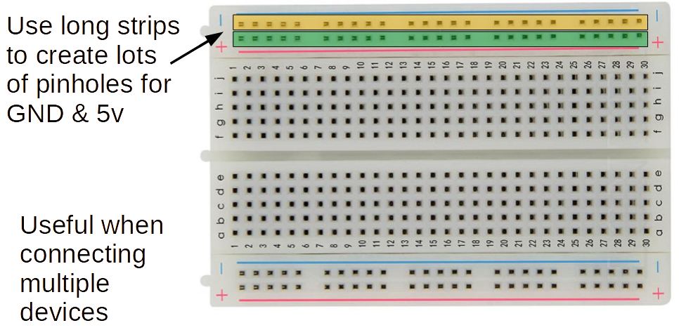
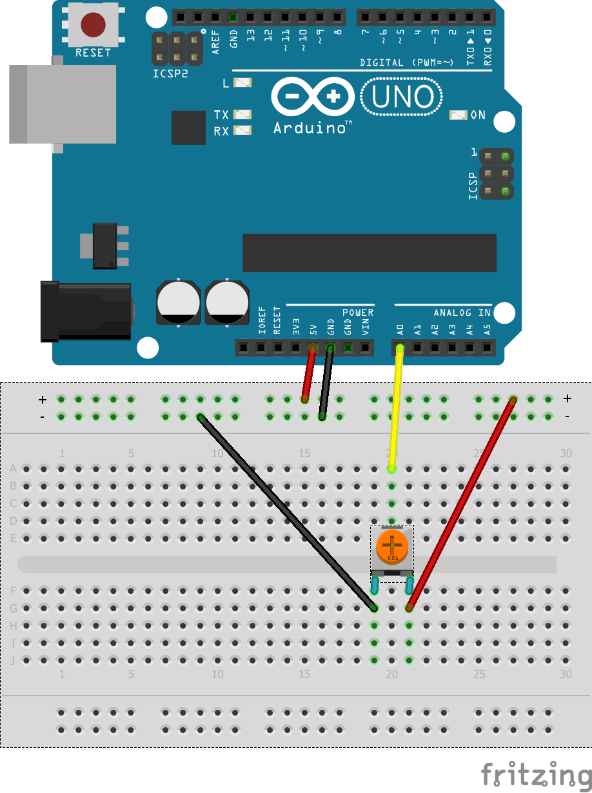
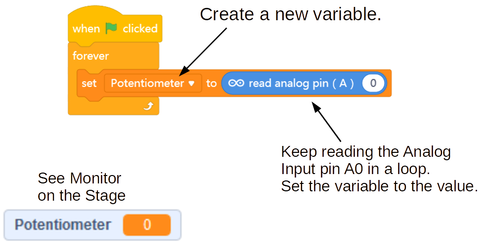

Challenge 2c
===

So, let's utilize a potentiometer as an Analog Input.  For now let's just make sure we can read the signal in correctly.  Later, we will figure out neat things to do with the readings...

First, let's connect our potentiometer to the Arduino board.

It is useful in our more advanced projects to have a **Power Bus** - that means a strip of pin holes on the breadboard that will provide many leads to GND and +5V from the Arduino.  As many of our devices will requires power to work, we cannot depend on a single 5V pin, or even 3 GND pins...

And here is how we will connect our Potentiometer using a power bus.

***NOTE: Be careful when you insert the potentiometer's legs into into breadboard holes - don't bend them too much or they will break!***

 

## Read Analog Input into Variable

 

 

<ol>
<li>What are the minimum and maximum values read?</li>
<li>What would be the half value, that is (max - min)/2?</li>
<li>Write code that makes Panda say "LOW" if the reading is between minimum and half, and say "HIGH" if the reading is greater than half.  Remember you will need to Broadcast from Arduino code to the Panda's code...</li>
</ol>

