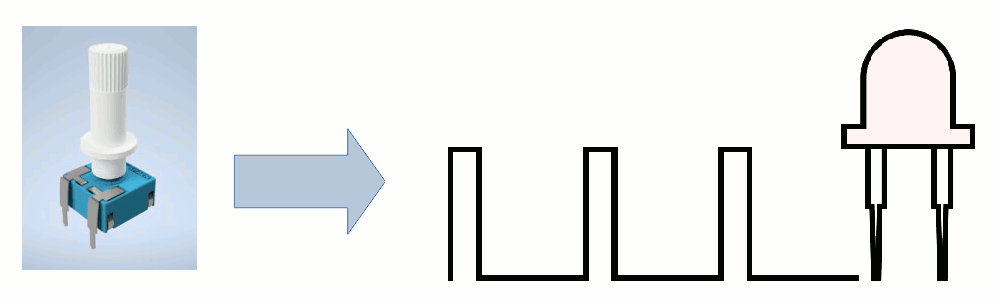
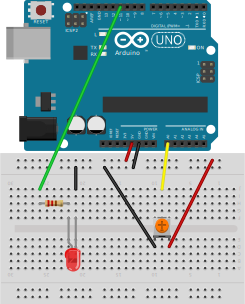
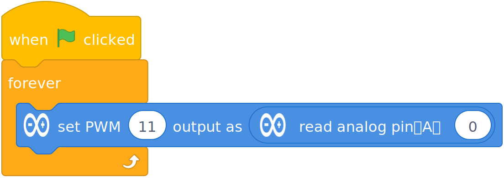
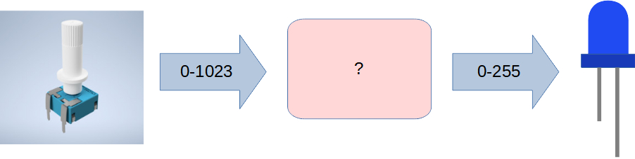
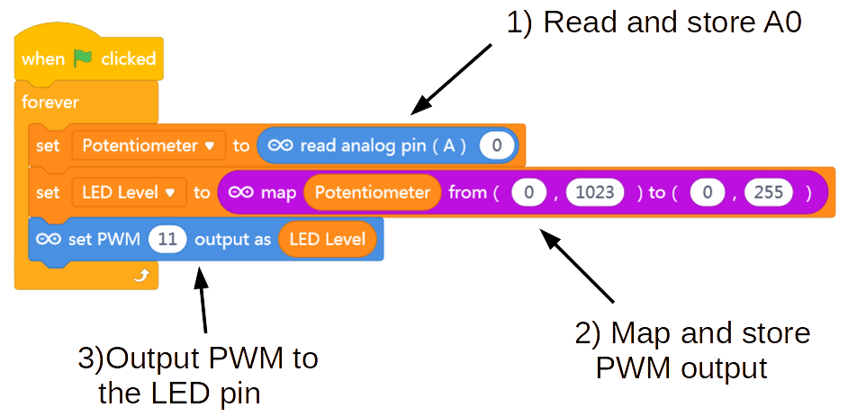

Mapping Input to Output
===

So, let's try to combine the new Read Analog code with the LED dimmer effect code to get our Potentiometer to control this effect:

 

 

## First, we will need to combine the simple LED circuit with the Potentiometer wiring - Potentiometer input into **Pin A0**, and LED PWM output from **Pin 11**:
 

## Can't we just do this???
 

## If not, why?

Well, what was the maximum value that *Set PWM Output* block expected? (255)

And what what was the maximum value that *Read Analog* block returned?

You see the issue?

We need to come up with a mapping that let's us read the analog value from our potentiometer, and map it to a number between 0 and 255, and then output that mapped number to the LED.

## Luckily there is a *Map* block that can do this for us!

 

*Map* takes the range from one type of data (say, analog input) and converts it to a range of another kind of data (say, analog output)...

Note that we created a **second variable** called *LED Level* to store the mapped data value.

What else can we do with this???