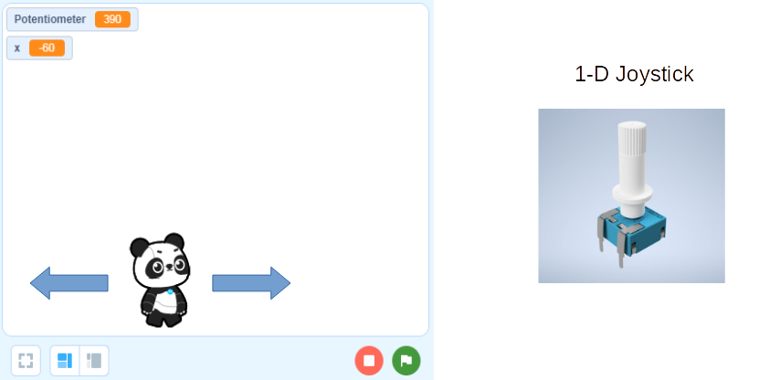
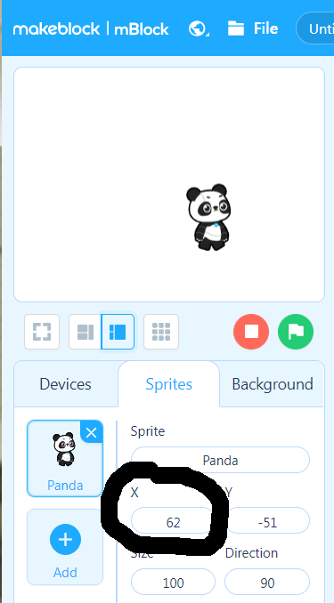
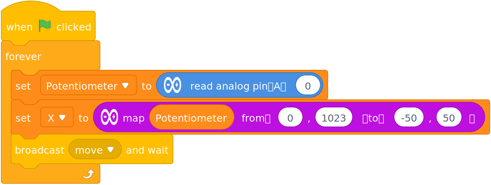
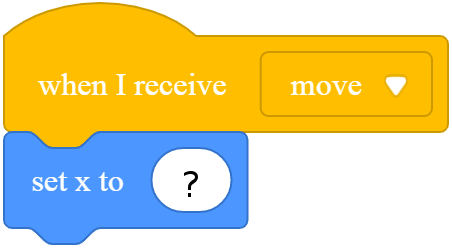

Challenge 2d
===

## Move, Panda, Move!

Let's turn our potentiometer into a Joystick for moving Panda.

We would like to use the Joystick as an encoder of the Panda's actual location.  

Just as before a potentiometer value encoded a particular LED brightness level, now the potentiometer value will encode a particular Panda location. 

There are other ways to make a joystick behave, which we can look at later...

But, first you need to figure out what is Panda's X-Axis range of values...  You can move it around the screen and look at its X values, or you can change the X to extreme values and see where they are capped.

Let's say Panda can move on the X-Axis from -50 to 50 (it can move more, but it's up to you to figure out how much!).

Our mapping function would look like this:

So now that we know how to read in the Joystick input value and convert it to Panda's X-Axis, how do we tell Panda where to go?

We could create 100's of broadcast messages - one for X=0, one for X=1, one for X=2, one for X=3, and so on.  That seems tedious... 

Instead we are going to use a **"Global Variable"** to set the data in one place (Arduino Code), and then read it in another place (Panda Code).

First let's make a *"For All Sprites"* variable called **X**.  

*For All Sprites* means it is Global - everyone can set and read this variable.

Now let's set this variable just like we did the LED Level in the previous exercise, but this time, instead of outputing a PWM level to light the LED, we will send Panda a message to tell it it's time to move...

Ok, now that the Arduino Joystick part is done, we need to go to the Panda Sprite to code the rest - what to do when we get the Move broadcast message:

NOTE: We created a global X variable... That would be associated with a dark orange block.  What is this blue Set X block?  What does it do?

When you figure this out, your Panda should start moving nicely with the Arduino Joystick.