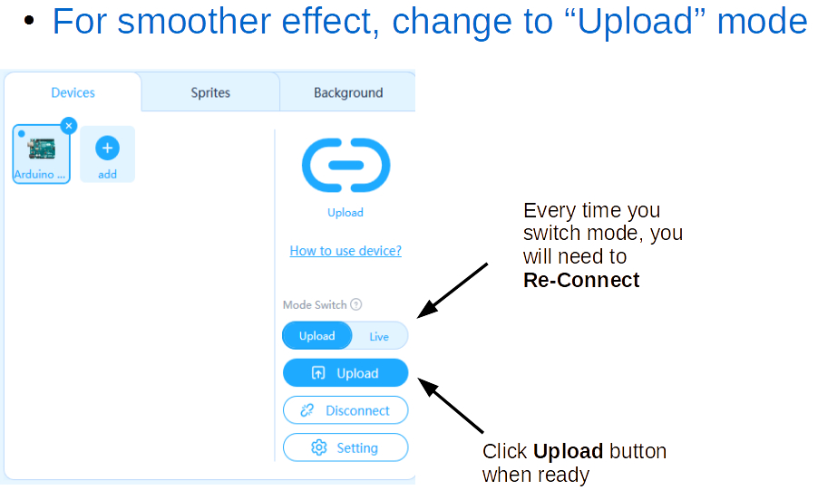
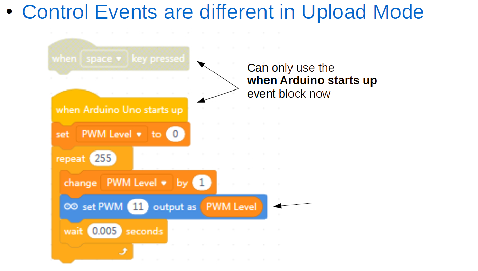

Extra Challenges
===

## 2e Upload Mode

NOTE: If you want to change back to *"Live Mode"* after using *"Upload Mode"* you will need to also reset the frimware - click the *Setting* button and follow instructions.

## 2f UI Dashboard

In Live Mode, create a Graphical Dashboard to control Lights (on/off buttons, slider dimmers, blink buttons)

## 2g Toggle Dimmer

Use a physical push-button to act as a Toggle Dimmer Switch (on/off)

## 2h Analog Blink Rate

Use a Potentiometer to code how fast an LED is blinking (instead of how bright it is shining)

## 2i Etch a Sketch Panda

Use 2 Potentiometer Joysticks, one to control X and one to control Y of the Panda.

Here's how you'd wire up two Potentiometers:

