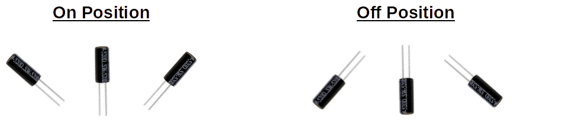
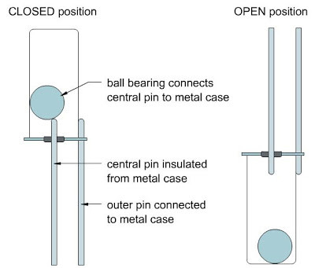
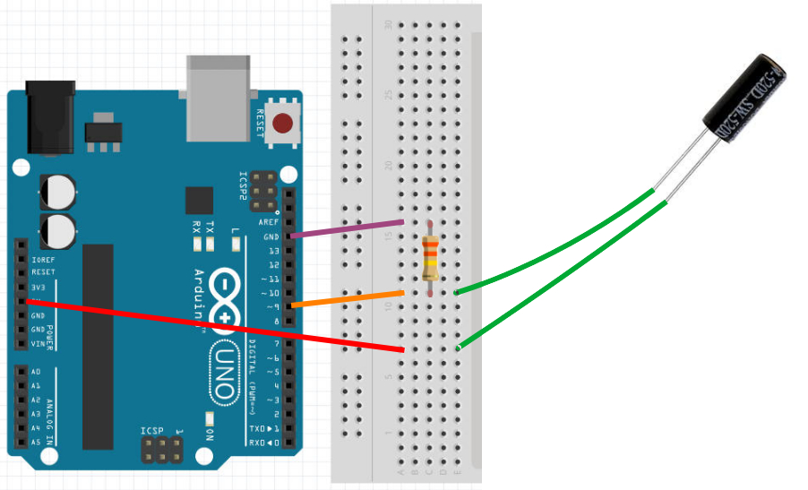

Tilt Sensor
---

- Turns on when tilted upwards
- Turns off when tilted downwards
- Works just like a push button switch
    - Needs pull-up / pull-down resistor!
  

## How It Works

A simple mechanical switch:  
A metal ball completes a connection when the sensor is pointed upwards...

## Wiring & Coding

Wiring is similar to the push button switch wiring...

Read state in code using any digital pin:

