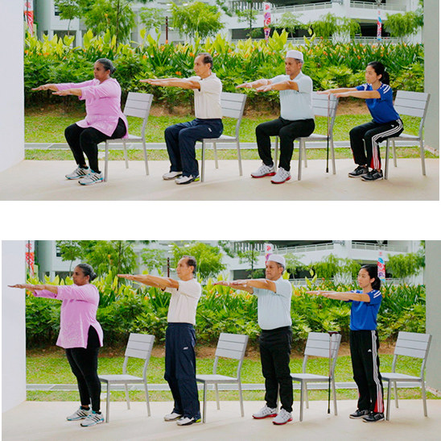
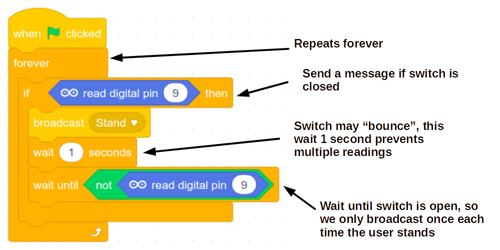
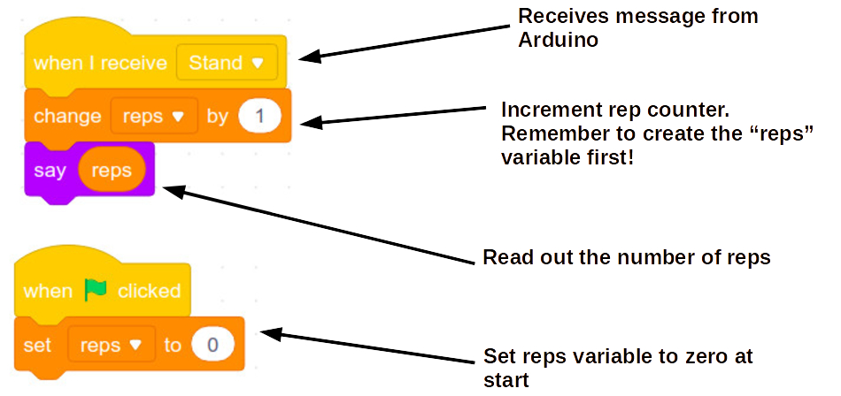

Exercise 3a - Sit / Stand
---

We can use the Tilt sensor to track certain movements.

In the Sit & Stand exercise regime, the user is instructed to do certain reps of the movement pattern.  The tilt sensor is attached to the user, and helps monitor the number of reps made.

In this exercise we need to attach the tilt sensor to the leg with a elastic strap.

## Example

Tilt sensors work like a simple switch (ON/OFF), so we can track the exercise progression in mBlock directly, and can even display encouraging messages on screen!

On the **Arduino** side, we would need to broadcast each successful rep:

  

On the **Stage/Sprite** side, we need to code a Sprite to react to progress in the exercise regime:

