Ultrasonic Distance Sensor
---

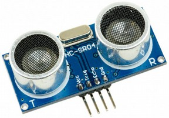
 
 

The Ultrasonic Distance sensor works like most sound wave-based sensors - using a transmitter to send a **ping** and a receiver to hear the **echo**.

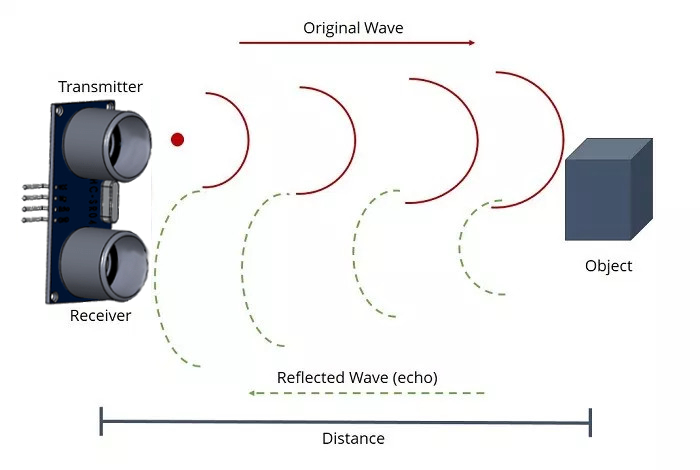

> Distance Signal Travelled = Time Elapsed  x  Speed of Sound

> Distance to Target = Distance Travelled / 2

## Using the Sensor

In mBlock the signal transmission, signal reception, and calculation of time elapsed and the conversion to distance is done for us under the hood:

You need to make sure the Sensor's **trigger** and **echo** pins are connected to the pins you're trying to utilize for the transmitter and receiver.

The value that's returned from that call is the distance in cm to the thing in front of the sensor.

Due to the time-sensitive nature of the sensor, we can only use Ultrasonic Sensor in **Upload Mode**.

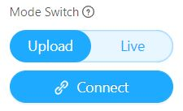

## Wiring the Sensor

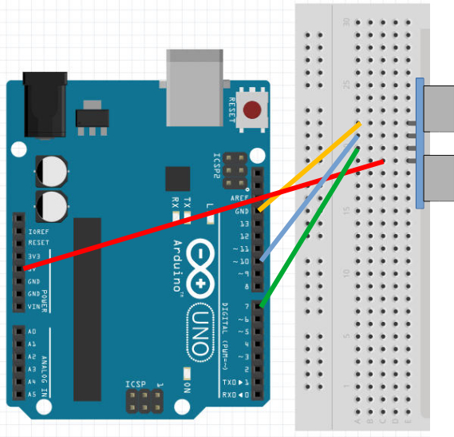

## **Pin Connections**

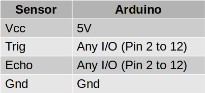

## Testing the Sensor

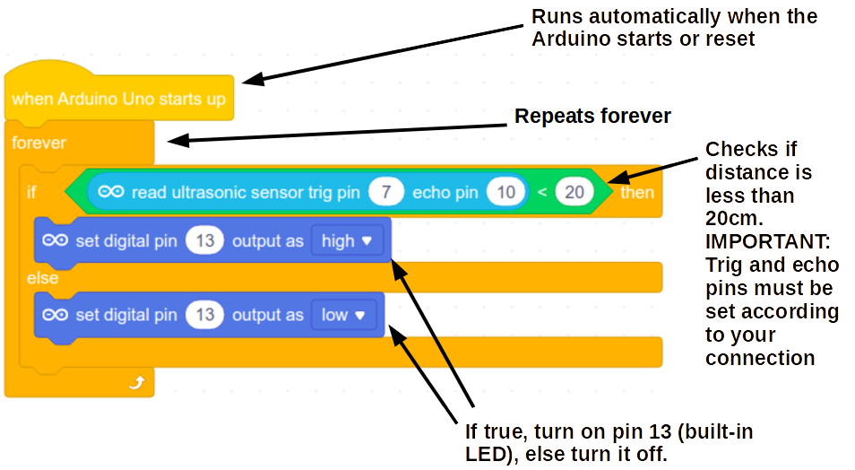

Test and make sure the built-in LED lights up when you perform some movement-based exercise, like a push-up or a sit-up.

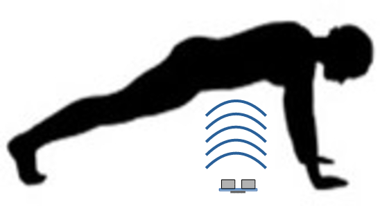

You may need to adjust the detection distance to be longer than or shorter than 20cm.

## Upload-Mode Broadcast

If you wish to interact withthe Sprites on stage, you will need to add an mBlock extension to **both the Device and Sprites**:

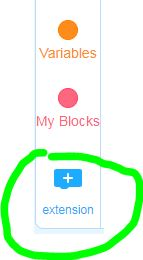

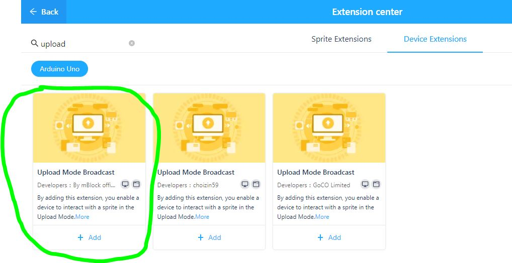

The Device and Sprite code might then look like this:

**Device**

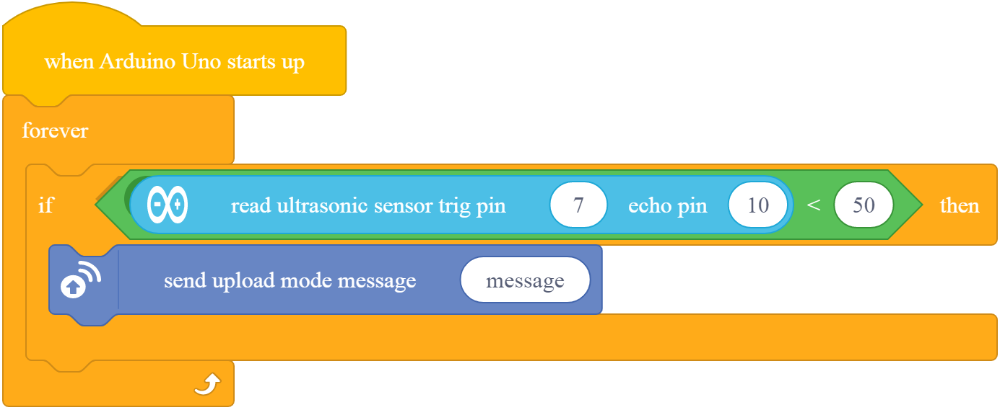

**Sprite**

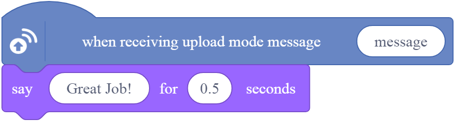
