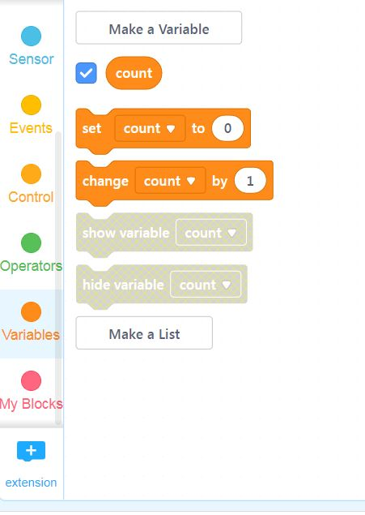
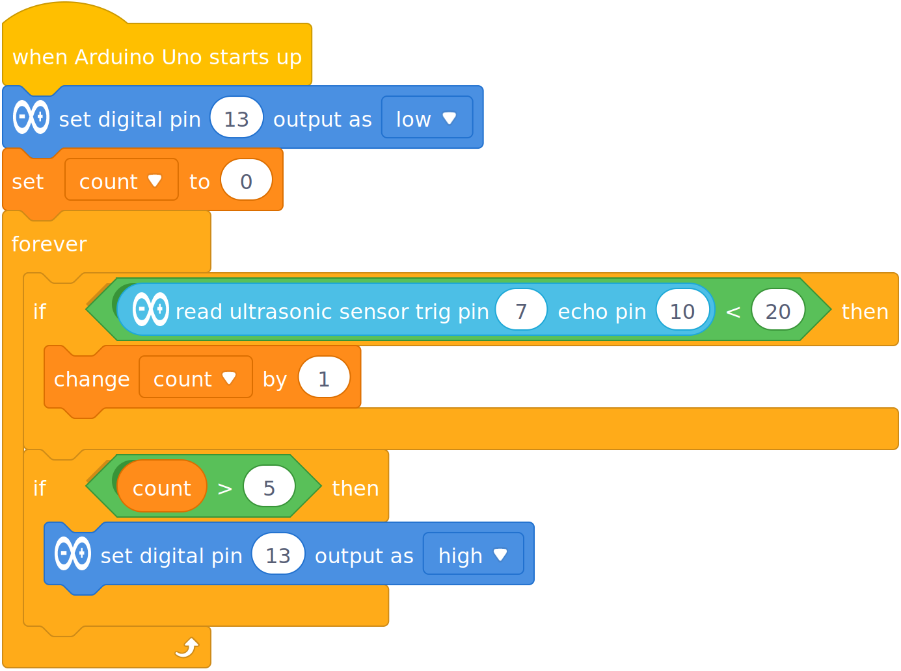

Challenge 3b - Exercise Counter
---

Now we can only detect push-up, but not count each one...

A single push-up consists of two actions:
- Going down
- Returning up

Our program should detect both of these, and count the pair as a single push-up.

First, you'll need a variable to keep count.

Then let's change the code to light up after a set of 5 repetitions (reps):

NOTE: After each set, you can click reset button to restart Arduino and the reset the count back to 0...

Now test this code:

- Does it work?
- If not, why?

It shouldn't work, it probably lights up green after only 1 push-up.  **Why?**

Once your lower your body and the condition of the distance is met, the variable is increased by one, and the loop runs again... before you have a chance to get back up...

So we need to somehow wait and hold the program until you finish each rep.

Try to use this block to get this to work:

## *How else can you use the ultrasonic distance sensor in your Active Living solution design?*