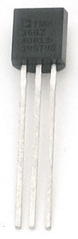
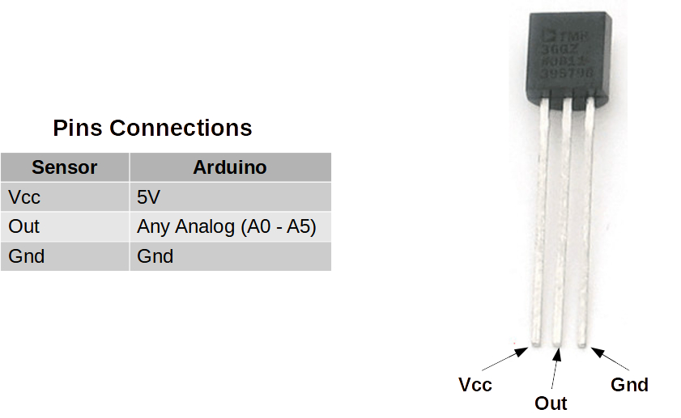
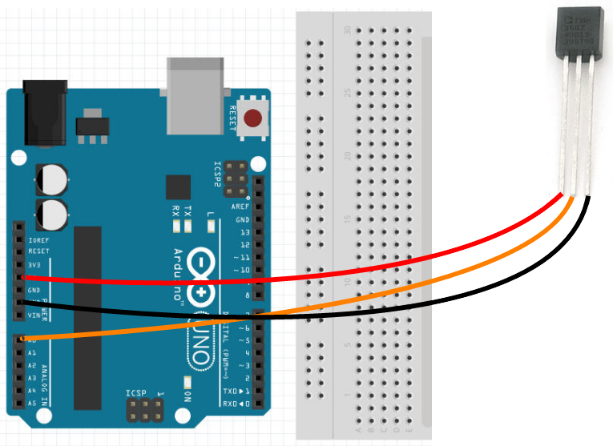

Temperature Sensor
---

<table>
<tr>
<td>Model</td><td>TMP36</td>
</tr>
<tr>
<td>Range</td><td>-40&deg; C to 150&deg; C</td>
</tr>
</table>

- Uses semi-conductors to measure temperature 
- Outputs an analog voltage

## Wiring & Coding

## Analyzing Temperature Reading

Reading the Temp Sensor output as an Analog Input will result in some value (0-1023).

How do we translate that value to an actual temperature?

First, convert the analog readin to a voltage (0-5V) or mVoltage - that is voltage in millivolts (0-5000mV):

Then, you will need to take that mVoltage value (0-5000), and convert it to a temperature using the fomrula provided by the sensor manfucaturer:

> Temperature (C) = (mVoltage - 500mv) / 10

So if you get 800mv, the Temp reading is:
> (800 - 500)/10 = 300/10 = **30&deg; C**

You will need simple math operation blocks to do this.

Note that most of the time we expect readings in the 20-40&deg; C range, so expect to see mostly values from teh sensor in the range 700-900mV.
