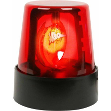

Exercise 3c - Overheat Alert

Wire up the temp sensor and write a program that:
- Continuously Measures Temperature
- Turns on Alarm When Too Hot!

Test the temperature sensor to see what should constitute a heat alert.  
(Hint: Also cold alert...)

You can use any means to alert, e.g.:

- mBlock sound
- mBlock animation
- LED
- Buzzer

