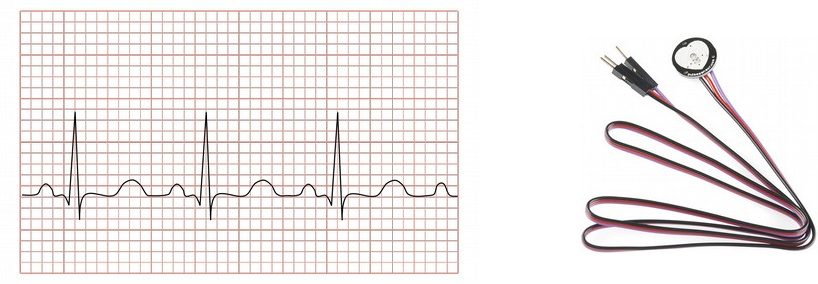
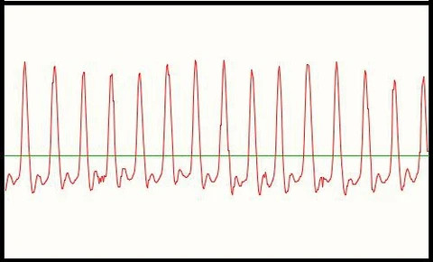
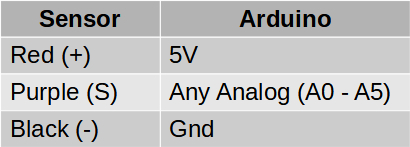
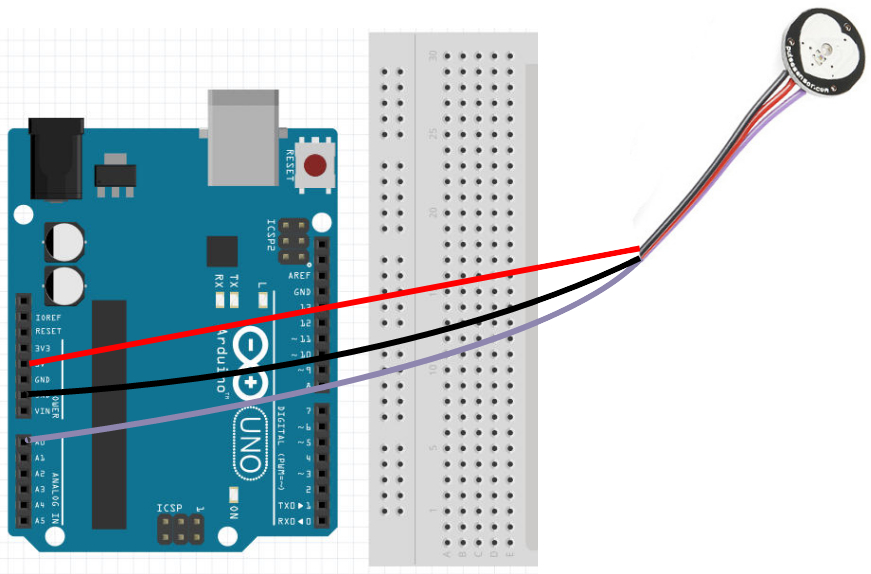
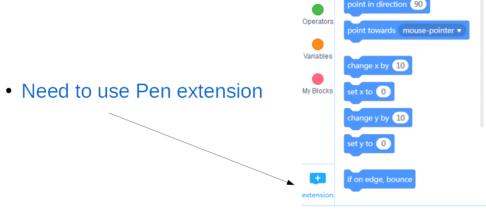
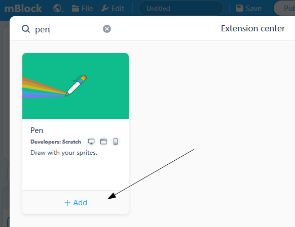
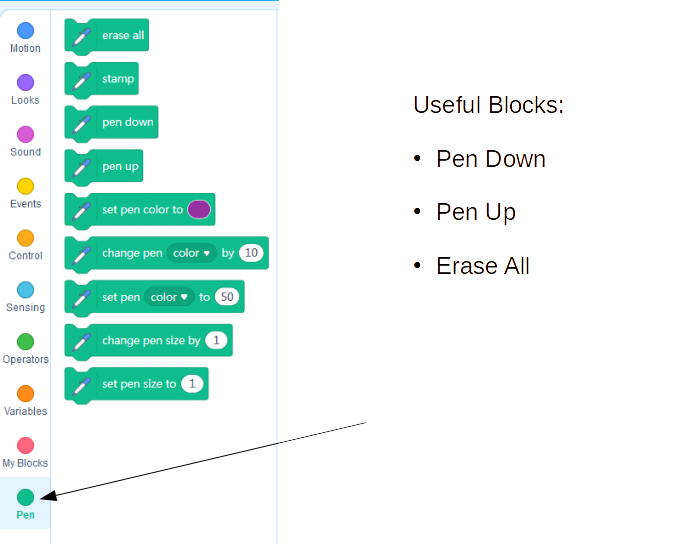
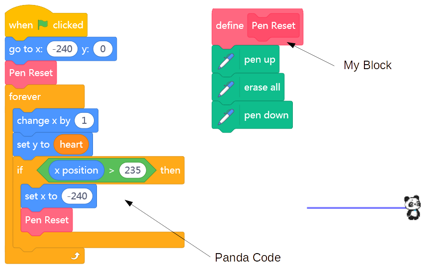
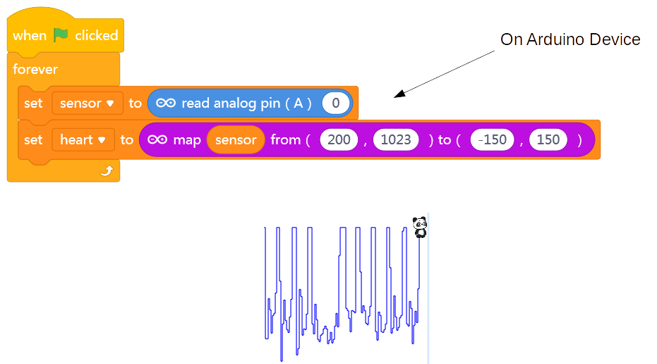

Heart Rate Sensor
---

- Measures amount of light passing through skin
- Amount of light changes with blood flow
- Provides analog voltage signal

Note how the Voltage rises above mid-point (512 in case of reading in through A0-A5 analog inputs) on every pulse.

## Wiring & Coding

### Pin Connections

- Plot Sensor Voltage reading as a timeline to create a Heart Monitor
- Need to convert Input reading (0-1023) to a Y (-150 to 150) on the cartesian (XY) coordinate system of the Stage
- Plot using any sprite

