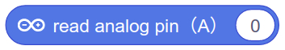

Heart Rate Sensor
---

- Measures amount of light passing through skin
- Amount of light changes with blood flow
- Provides analog voltage signal

Note how the Voltage rises above mid-point (512 in case of reading in through A0-A5 analog inputs) on every pulse.

## Wiring & Coding

### Pin Connections

- Plot Sensor Voltage reading as a timeline to create a Heart Monitor
- Need to convert Input reading (0-1023) to a Y (-150 to 150) on the cartesian (XY) coordinate system of the Stage
- Plot using any sprite

## My Blocks (aka Functions)

Whenever you have some pattern of code that you're going to want to repeat in your program, it is advisable to turn it into a Function. 

A function is a a bunch of coding blocks that are bunched together and can be called with a single new block.

For instance, to reset the Heart Monitor, we need to:

- lift up the pen
- erase the screen
- move the pen tip to the left side of the monitor
- and put the pen back down again ready to record

All of that needs to happen at the begnning of our program, and every time the pen tip reaches the right edge of the monitor...

So, we can bundle it up in a My Block function, and call it in different places in our code.

First, create a new My Block:

Then, give your function a meaningful name that encompasses whet it's for:

Finally, define the new function by associating it with a sequence of other base blocks.

Once a function is defined in this way it can be used just like any other code block.

## Integration

