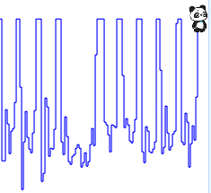
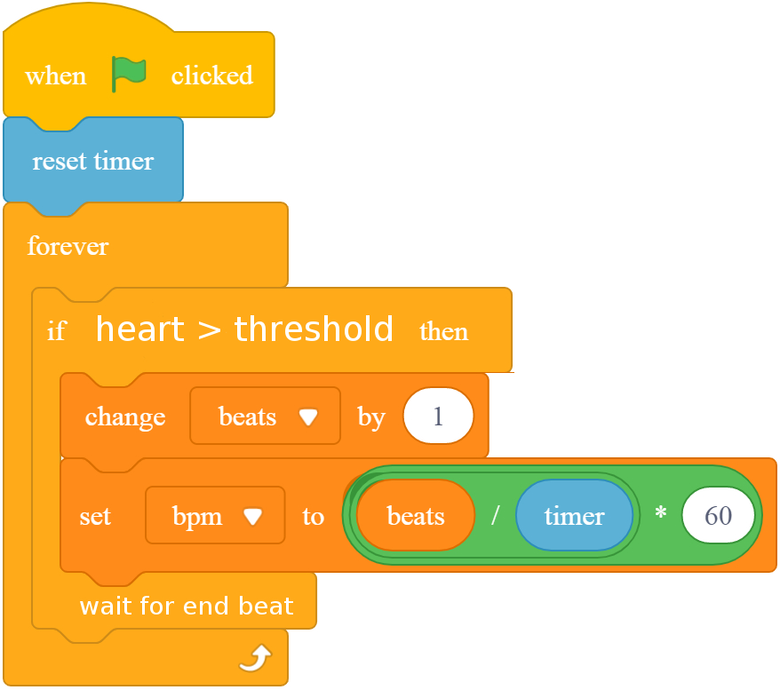

Exercise 3d - BPM

On top of showing the EKG timeline, add heart beats to the monitor.

- Count beats When sensor passes threshold
- No over-counting 
    - Before you can count another beat, you have to wait for the first to finish
- Hint: See how we waited for Ultrasonic Sensor to count a full push-up, or Tilt Sensor to wait for a rep to complete...

Use Timer to keep track of time, and on every beat calculate:

> BPM = # of beats / time-in-seconds * 60

 

