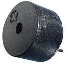
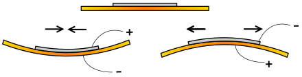
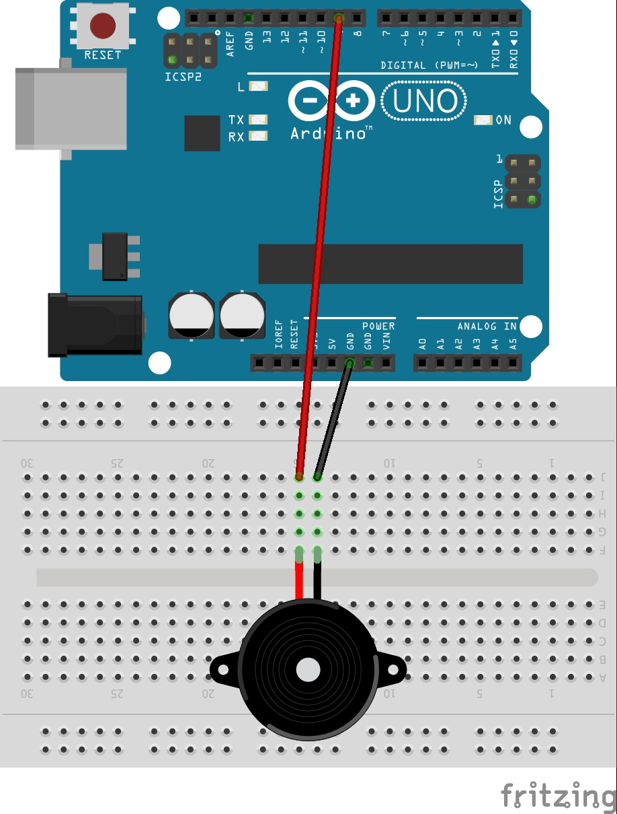
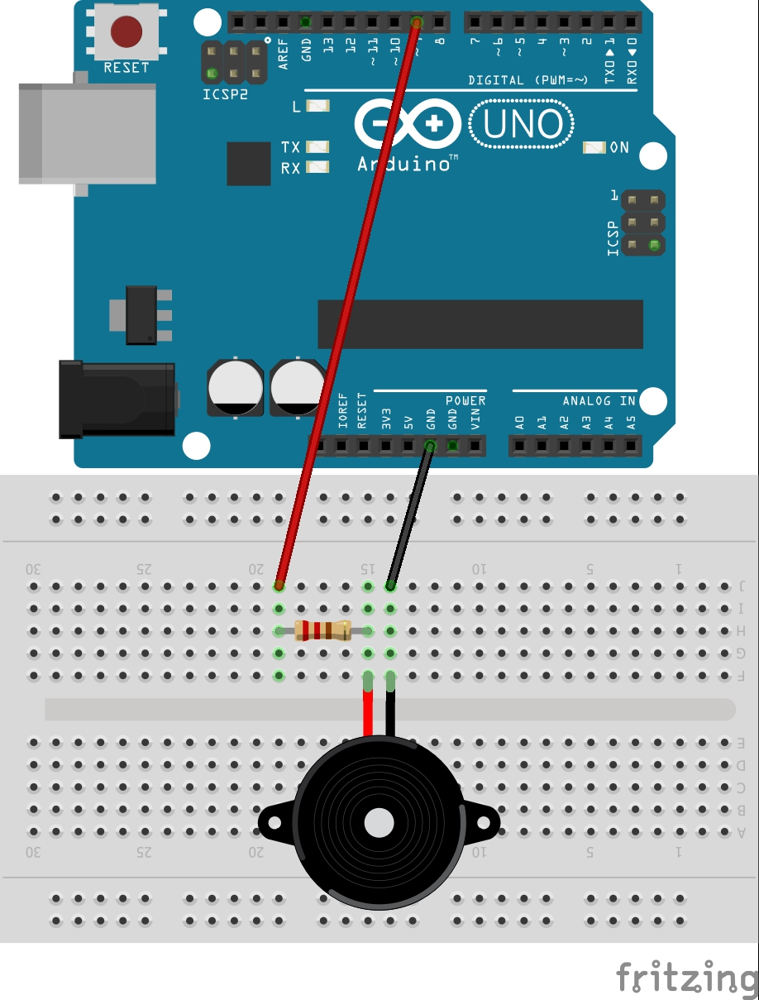

Buzzer
---

Buzzers are miniature speakers, which vibrate with electrical signals.  The vibrations make sound. 

## Piezoelectric Material 

Common buzzers like the ones we will be using are made with piezoelectric material, which has a physical reaction to electricity - it bends.  Send puleses of electricty through the piezoelectric material causes to bend back and forth causing the vibration needed to produce sounds.

## Active Buzzer

- Plays only a single tone
    - Cannot control tone or play music
- Doesn’t require a resistor
- Cannot be reversed

Just turn on the signal switch when you want to hear the tone.  You can make it beep on/off just like we programmed the LED to blink.
  

## Passive Buzzer

- Plays various tones based on signal provided
- Safer to use a resistor like with an LED
- Need to pass a more complex signal similar to PWM

Wiring (same as for active, but add a small series resistor like for LED):

