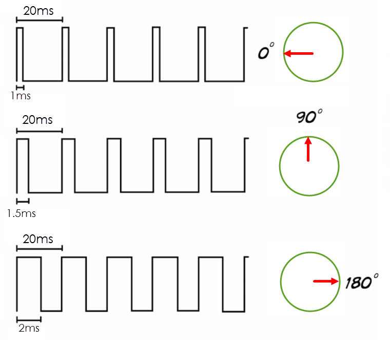

Servo
---

Servos use basic DC motors, gears, and electronics to create a specialized motor that can be rotated to a specific position.

Most servos rotate partially. e.g. 0-180 degrees - some have full or continuous rotation. 

## Working Concept 

Servos have a DC motor, a potentiometer, some gears, and a control unit.  Its shaft connected to gears and an output shaft, as well as a potentiometer.  THe potentiometer output is read by the control unit, which determined which direction to run the motor, and when to stop and hold it in place.  The components are usually encased in a box, 

## Signals

Ther Servo input signal is similar to PWM and is used to communicate a desired position with the Control Unit.

## Working with Servo

There are all sorts of ways a servo can be used in a project, for example:

- Control a door or gate
- Electronically-controlled mechanical lock
- Physical indicator
- Dispenser

## Code

This is the code block to use to control the Servo:

Which means set the Servo connected to Pin 9 to a 90-degree angle position.
