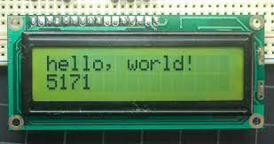
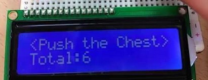
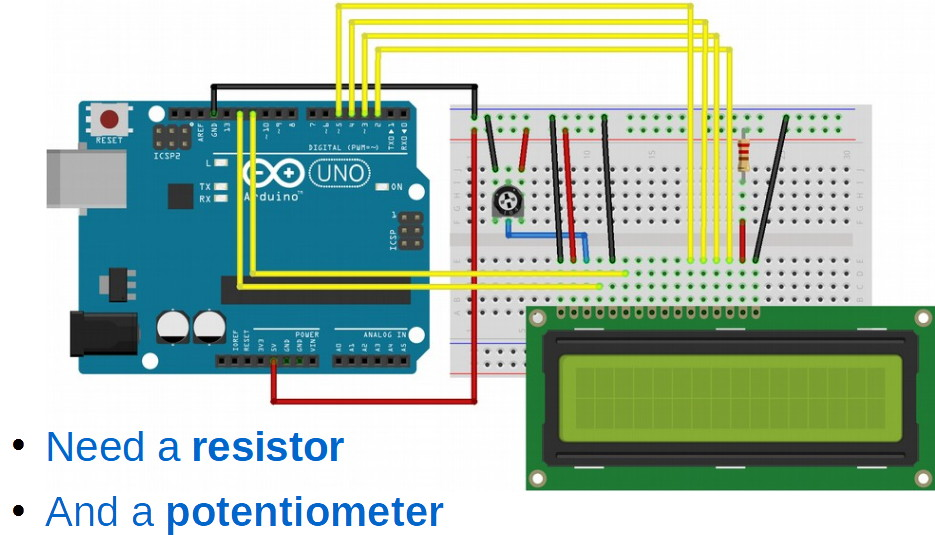
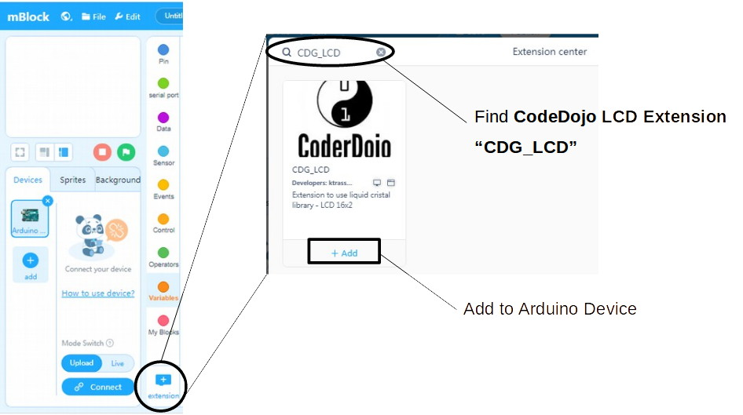
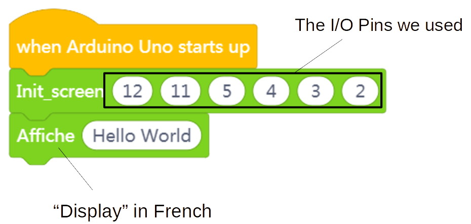

LCD
---

If we want to make a stand-alone device not connected to the laptop, then we usually need some way to communicate back with the user.

We can communicate with blinking LED lights and beeping tones on speakers, but we can also write out text messages using a digital display, like an LCD or Liquid Crystal Display.

LCD Features:

- Cheap, monochrome version of LCD TV
- Can display 2 lines of text, 16 chars each
- Only works in Upload mode
- Best used when you want tell user things that are hard to communicate with just LEDs, like counting numbers higher than 3... 

---

The LCD may be quite cumbersome for wearable device, but remember we are creating a prototype, not a final product.

Smaller OLEDs would be more appropriate.

## Wiring

Note that the yellow wires indicate the specific I/O pins that will be necessary in the Init block code below - 12, 11, 5, 4, 3, 2.

It can take a while, but you only need to sort it out once, and then the coding is quite simple. 

## Coding

You'll need an Arduino Extension for the LCD code blocks:

Once you have the extension in place, just setup the device using the Init function, and then call various display blocks to write out the text messages.

You can add animation using various control loops, waits, and display, or directly via the blink and scroll blocks in the LCD extension.  

Play around with it...
