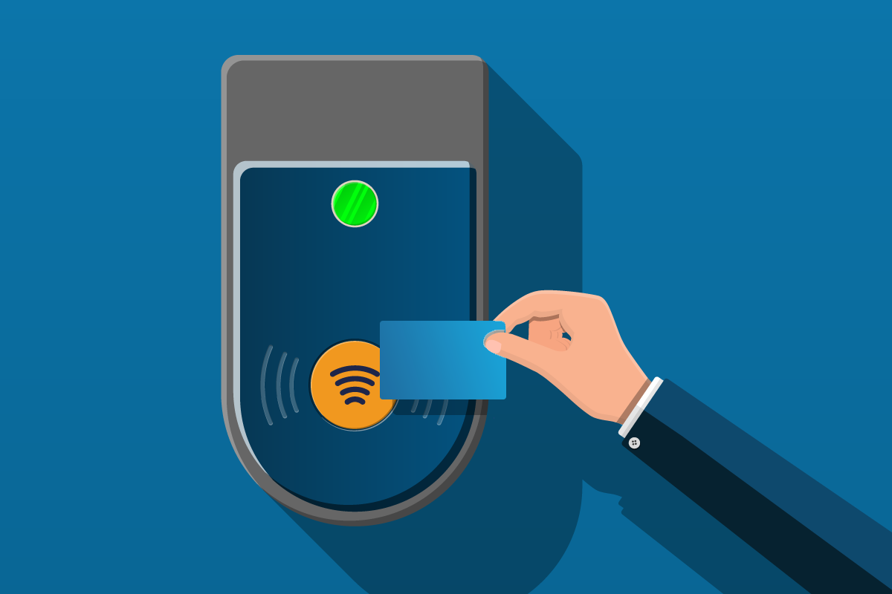
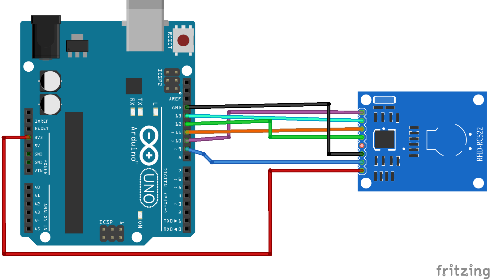
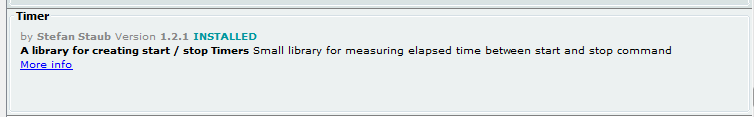
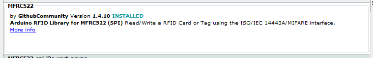

RFID
---

Radio-Frequency ID works using the radio portion of the electromagnetic spectrum to pass info wirelessly, but in very close range.  



It can be used to tag anything, living or non-living...

## Connecting the RFID Reader



<table>
<tbody>
<tr>
<td width="188"><strong>Pin</strong></td>
<td width="175"><strong>Wiring to Arduino Uno</strong></td>
</tr>
<tr>
<td width="188">SDA</td>
<td width="175">Digital 10</td>
</tr>
<tr>
<td width="188">SCK</td>
<td width="175">Digital 13</td>
</tr>
<tr>
<td width="188">MOSI</td>
<td width="175">Digital 11</td>
</tr>
<tr>
<td width="188">MISO</td>
<td width="175">Digital 12</td>
</tr>
<tr>
<td width="188">IRQ</td>
<td width="175">unconnected</td>
</tr>
<tr>
<td width="188">GND</td>
<td width="175">GND</td>
</tr>
<tr>
<td width="188">RST</td>
<td width="175">Digital 9</td>
</tr>
<tr>
<td width="188">3.3V</td>
<td width="175">3.3V</td>
</tr>
</tbody>
</table>

## Extracting Tag IDs

Tags come in many forms, but mainly:

- Cards
- Keychain Holders
- Stickers

No matter what kind, we can use the following Arduino code to extract their IDs.  You will need that to construct a *Database*.

Also you will need to dowload the Timer and MFRC522 (RFID protocal used by our electronics) libraries for this.




<style>
pre {
  white-space: pre !important;
  overflow-y: scroll !important;
  height: 10vh !important;
}
</style>

```{r setup, include=FALSE}
#include <SPI.h>
#include <MFRC522.h>
#include <Timer.h>

#define RST_PIN         9          // Configurable, see typical pin layout above
#define SS_PIN          10         // Configurable, see typical pin layout above

MFRC522 mfrc522(SS_PIN, RST_PIN);  // Create MFRC522 instance

Timer t;
String lastUID;

String getUID() {
  String content= "";
  byte letter;
  for (byte i = 0; i < mfrc522.uid.size; i++) 
  {
   //  content.concat(String(mfrc522.uid.uidByte[i] < 0x10 ? " 0" : " "));
     content.concat(String(mfrc522.uid.uidByte[i], HEX));
  }
  content.toUpperCase();
  return content;
}

void setup() {
	Serial.begin(9600);		// Initialize serial communications with the PC
	while (!Serial);		// Do nothing if no serial port is opened (added for Arduinos based on ATMEGA32U4)
	SPI.begin();			// Init SPI bus
	mfrc522.PCD_Init();		// Init MFRC522
	delay(4);				// Optional delay. Some board do need more time after init to be ready, see Readme
	mfrc522.PCD_DumpVersionToSerial();	// Show details of PCD - MFRC522 Card Reader details
	Serial.println(F("Scan PICC to see UID, SAK, type, and data blocks..."));
}

void loop() {
	// Reset the loop if no new card present on the sensor/reader. This saves the entire process when idle.
	if ( ! mfrc522.PICC_IsNewCardPresent()) {
		return;
	}

	// Select one of the cards
	if ( ! mfrc522.PICC_ReadCardSerial()) {
		return;
	}

  String UID = getUID();
  //Serial.println("UID = " + UID + ", LastUID = " + lastUID);
  if (lastUID != UID || t.read() > 4000) {
    Serial.println(UID);
    t.start();
  }
  lastUID = UID;

}
```

Run this code on your arduino.

Check the Serial Montior output...

You will need to copy the Tag IDs as needed in the RFID project code.

See "matchdb" lines in the Card Game under Steup() function.

## Creating a Card Game

In this exercise we will match 2 cards to each other and blink a light if we have a good match.

You will need to create match cards, and affix RFID tags to them.  Then read the pairs, using the above code, and copy those pairs as needed in the code below - where we setup matchdb's.

The basic code to load is as follows:

```{r setup, include=FALSE}
#include <SPI.h>
#include <MFRC522.h>
#include <Timer.h>

#define RST_PIN         9          // Configurable, see typical pin layout above
#define SS_PIN          10         // Configurable, see typical pin layout above

MFRC522 mfrc522(SS_PIN, RST_PIN);  // Create MFRC522 instance

#define MAX_SIZE 52

String matchdb1[MAX_SIZE];
String matchdb2[MAX_SIZE];

bool isMatch(const String& first, const String& second) {
  int index1 = -1, index2 = -1;
  for(int i = 0; i < MAX_SIZE; ++i) {
    if (matchdb1[i] == first) {
      index1 = i;
      Serial.print("Index 1 = ");
      Serial.println(i);
      break;
    }
  }

  if (index1 == -1) {
    Serial.println("First card not in match DB");
    return false;
  }

  for(int i = 0; i < MAX_SIZE; ++i) {
    if (matchdb2[i] == second) {
      index2 = i;
      Serial.print("Index 2 = ");
      Serial.println(i);
      break;
    }
  }

  if (index2 == -1) {
    Serial.println("Second card not in match DB");
    return false;
  }

  return index1 == index2;
}

Timer t;
String lastUID;

bool inProgress;

String getUID() {
  String content= "";
  byte letter;
  for (byte i = 0; i < mfrc522.uid.size; i++) 
  {
   //  content.concat(String(mfrc522.uid.uidByte[i] < 0x10 ? " 0" : " "));
     content.concat(String(mfrc522.uid.uidByte[i], HEX));
  }
  content.toUpperCase();
  return content;
}

void setup() {
  Serial.begin(9600);   // Initialize serial communications with the PC
  while (!Serial);    // Do nothing if no serial port is opened (added for Arduinos based on ATMEGA32U4)
  SPI.begin();      // Init SPI bus
  mfrc522.PCD_Init();   // Init MFRC522
  delay(4);       // Optional delay. Some board do need more time after init to be ready, see Readme
  mfrc522.PCD_DumpVersionToSerial();  // Show details of PCD - MFRC522 tag Reader details
  Serial.println(F("Scan PICC to see UID, SAK, type, and data blocks..."));

  // Build Match Tables (up to 52 slots)
  matchdb1[0] = "DEF26C7A";
  matchdb2[0] = "BEE26C7A";

  matchdb1[1] = "30307825";
  matchdb2[1] = "80C67A3";

  inProgress = false;
}


String first, second;

void loop() {
  // Reset the loop if no new tag present on the sensor/reader. This saves the entire process when idle.
  if ( ! mfrc522.PICC_IsNewCardPresent()) {
    return;
  }

  // Select one of the tags
  if ( ! mfrc522.PICC_ReadCardSerial()) {
    return;
  }

  // Make sure it's a new Unique Tag
  String UID = getUID();
  //Serial.println("UID = " + UID + ", LastUID = " + lastUID);
  if (lastUID != UID || t.read() > 4000) {

    // Presenting First Card
    if (inProgress == false) {
      inProgress = true;
      first = UID;
      Serial.println("First = " + UID);
    }

    // Presenting Second Card, check match
    else {
      second = UID;
      Serial.println("Second = " + UID);
      if (isMatch(first,second)) {
        Serial.println("MATCH!");
        // Blink Light
        digitalWrite(2, HIGH);
        delay(1);
        digitalWrite(2, LOW);
        delay(1);
      } 
      else {
        Serial.println("NO MATCH...");  
      }
      inProgress = false;
      first = second = "";
    }
    lastUID = UID;
    
    Serial.println(UID);
    t.start();

    
  }

}
```
