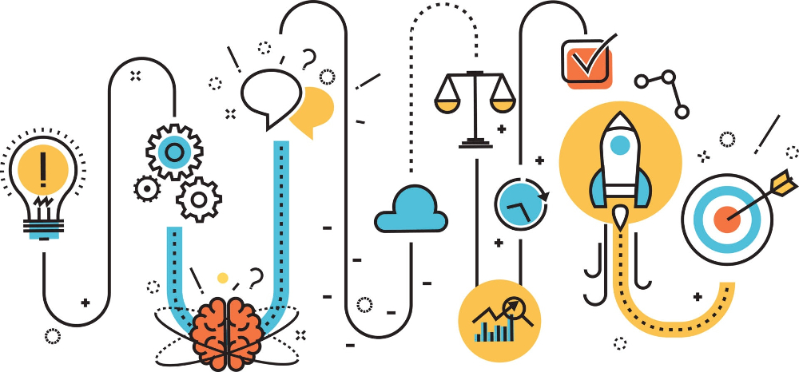
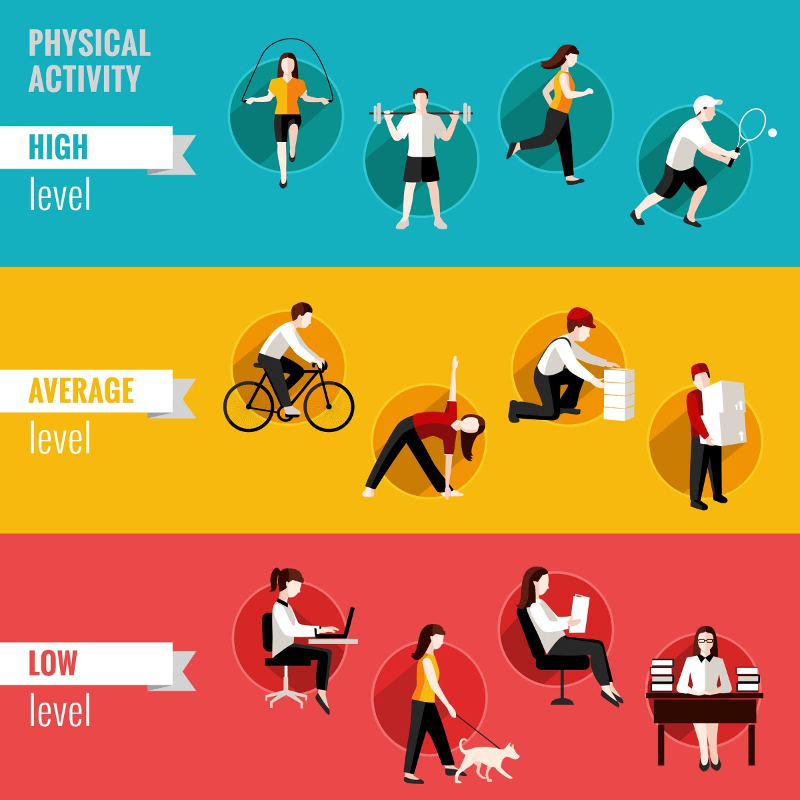

ALP Project Overview
---

Product developers and policy makers utilize **Design Thinking** processes to come up with ideas that solve real-world problems.

The main issue we will be dealing with is *Active Living*.

## Active Living

Even before COVID-19 there has been a rise in health issues like obesity, diabetes, arthritis, osteoporosis and many more.  

As people's jobs and social interactions become more and more desk-bound, and as our lives take on a more digital nature, people are moving less, going outside less, utilizing public parks less, and generally living a more physically inactive life.

## Help the HPB

In Singapore, the Health Promotion Board (HPB) is in charge of providing people with resources for improving their general health.  

Can we help HPB come up with the next big idea?

Some ways we can improve people's active living activities:

- Making them safer
- Making them more fun
- Improve ease of tracking progress
- Improve convenience
- Provide rewards
- Improve awareness of benefits

## Design Thinking Process

So now we know what we are trying to do - our mission is to come up with a snazzy way to get some target group of people in Singapore living a more active lifestyle.  Why?  To help improve the general health of our population!

We have a general mission statement - how do we get from there to a specific product or policy solution that can be effective?

There are many approaches to coming up with designs and different creative types utilize all sorts of ways, but in the past few decades a group of deisgners and academic thinkers in this area have come up with a set of general guidelines that can help anyone move through this process in a more coordinated and effective way.

### Definition
*Design Thinking is an iterative process in which we seek to understand the user, challenge assumptions, and redefine problems in an attempt to identify solutions.*

## Phases of Design Thinking

* Empathize - understand the user
* Define - get to the bottom of the issue
* Ideate - creativity & innovation
* Prototype - make it happen
* Test - review whether and how well design solves problem