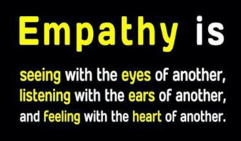

Empathize
---

* Understand the human needs involved.
* Research and consult experts
* Observe, engage, empathize with users
* Immerse yourself in the same environment as the user (body storming)

The first step in our formal Design Thinking process is to put ourselves in the shoes of the people we are trying to help.  Empathy is the ability to understand and share someone else's feelings... 

It sounds easy, but most of the time when we think we're being empathetic, but instead we are making a lot of assumptions about others.

People don't think alike and it's quite hard to really look at the world from the perspective of someone else's brain.

## Empathy as a Process

* Pick a User
* Interviews
* Boystorming

## Pick a User Group

Find a group of people whose Active Living needs you'd like to address, for instance:

* Working Adults
* Teenagers (like you)
* Couch Potatoes
* Elderly
* Physically Disabled
* Parents
* Kids / Students
* Exercise Freaks
* Economically Challenged
* Everyone

## Interviewing Potential Users

- Prepare questions: How? What? Why?
     - How often do you exercise? 
     - What exercise do you do? 
     - Why do you exercise?
 
 
- Test your questions on a team mate before actual interview
 
 
- Avoid negative questions
    - **Bad**
        > Why don't you exercise more?
    - **Good**
        > What did you enjoy most from your last exercise session?

## Bodystorming

- Act out the situation or role that you are targeting
- Understand the problem and avoid assumptions
- Example:
    - Using exercise equipment while seated to understand difficulties faced by wheelchair users
    - Try jogging with foggy glasses to simulate the difficulties faced by people with poor vision

[Bodystorming Example](https://www.youtube.com/watch?v=FoygAHTGPRU)

## So, what now?

As a team decide:

- Who is your target user group?
- What is your Empathy plan, how will you get to understand their Active Living issues?
- Plan your empathy activity, e.g.:
    - Write out questions and test them on one another
    - Plan out how to bodystorm a likely active living scenario

Then execute your plan **outside of class time**
Fill out this [handout](download/empathy%20guide.pdf).