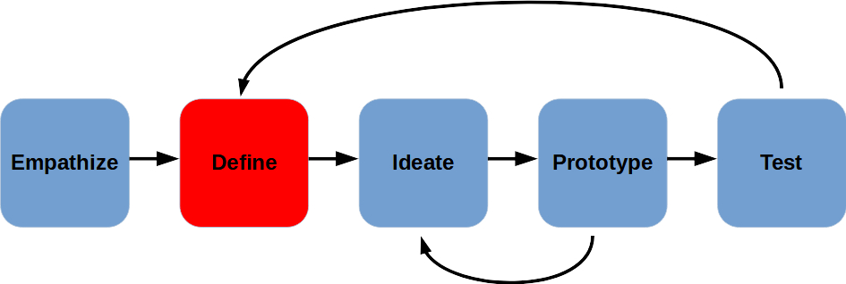
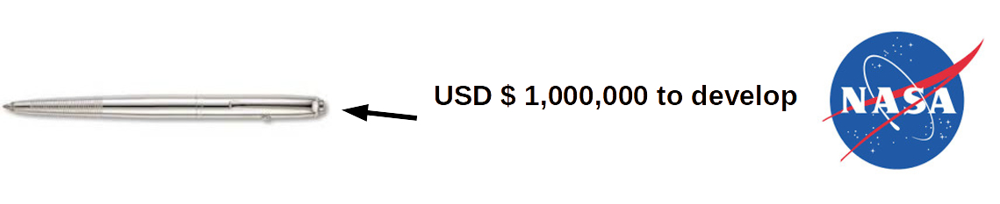
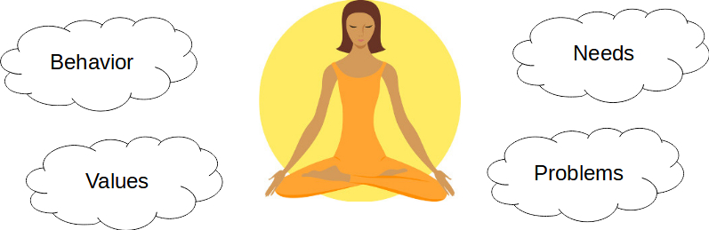

Define
---

- Write the Problem Statement
    - One of the hardest parts of the process

Empathize helps us gain insights.
 
Define helps us make sense of it!

Why is it important to Define the problem?

## Example of What Can Go Wrong!

In the 60s, NASA realized that normal pens do not work in space.

**Problem Statement**:
 *Ink won't flow without gravity*

**Solution**:
 *High tech pressurized pen that doesn't require gravity*

The Russian Space Agency encountered the same problem, but had defined the problem differently...

**Problem Statement:**
 *Pen won't work in space*

**Solution:**
 *Use a pencil*

## Good Problem Statements

- Human-centered
- Broad enough for creative freedom
- Narrow enough to be manageable

## 5 "Why" Technique

One way to try to get to a good problem statement is by pretending to be a six-year-old who keeps asking "Why?"

The technique was developed by Toyota to help make sure designers put the user first in their process, and that they actually understood the user's needs and wants.

If you cannot answer "Why", go back to to the "Empathize" stage, don't make assumptions!

### *Example*

> Observation: Working adults are often unhealthy.

- Why are they unhealthy?
    - Because they didn't exercise enough
- Why don't they exercise enough?
    - Because they are too busy.
- Why are they too busy?
   - Because they have work and family time.
- Why are they not exercising during family time?
   - Because their kids couldn't join them.
- Why couldn't their kids join in the exercise?
   - Because the exercise facilities are not suitable for kids.

## So, what now?

As a team, work on your problem statement by looking at your Empathy report, discussing the main issue and drilling down to the Why of the matter...

If you need to re-empathize, this is still a good time to get a better understanding of your user.  But don't dilly dally any longer!

Fill out this [handout](images/define%20guide.pdf).