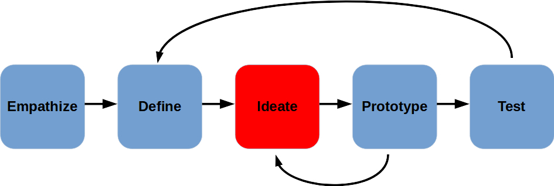
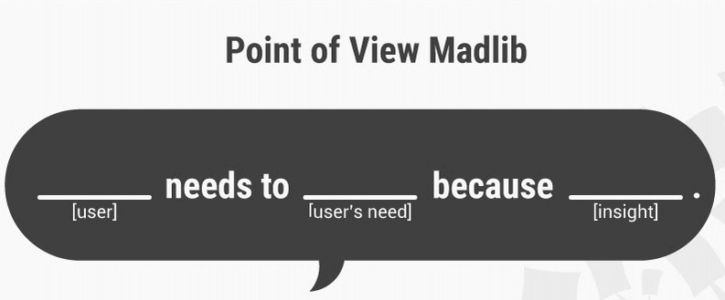
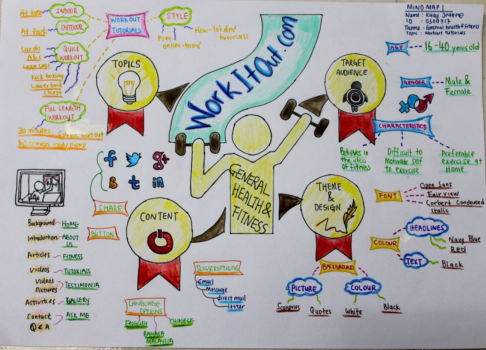
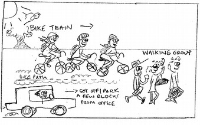

Ideate
---

- Generate Solutions for Problem Statement
- It's a creative process, trying to come up with non-obvious, unique ideas
- Define gave us a clear sense of what we want to solve
- As a Group, we can come up with some Unexpected Solutions

Important to have a **well-defined Problem Statement** from the previous Design Thinking stage, Define:

## Ideation Process

- Keep Open Mind
- Listen to Others
    - We Each Have a Unique View
- No Stupid Questions
- No Wrong Answers
- Break Down Problem Statement:
    - How Might We... (HMW)?

## Brainstorming

- Take turns discussing the problem and your ideas
- Take notes, but don't let that slow down conversation
- Add to ideas you like
- Pause before you give up on ideas you initially dislike
- A pictures tells a thousand words...
- Encourage wackiness - OK to be silly

> It is easier to tone down a wild idea than to think up a new one. - Alex Osborn 

## Worst Possible Idea

- Come up with as many bad ideas as we can
- List properties - what makes the worst idea so bad
- Search for opposite attributes
- Look for substitutes
- Mix & Match 

Once analyzed, a bad idea may turn out not so bad,
after all...

## Storyboarding

- Develop a story to illustrate problem/solution
- You need
    - Characters
    - Setting
    - Plot 
- Draw story out, like a comic
- Concentrate on relevant scenes
- Artistic skill not important, only convincing illustration of problem & solution matters

# So, what now?

As a team, utilize one or more of the above Ideation techniques, and come up with some product/policy idea you'd like to market to your User group as a way to get them living more actively!

If you need to re-empathize or re-define, this is your last chance to better understand your user before commmitting to some prototyping work. 

**Fill out this [handout](download/ideate%20guide.pdf).**