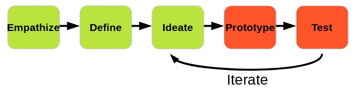
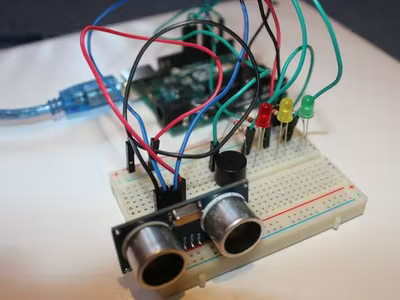
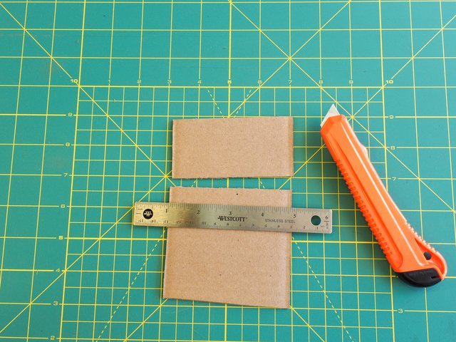
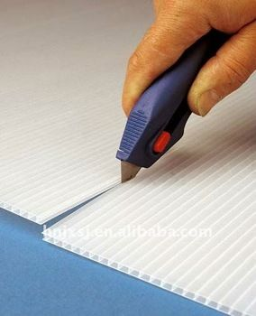

Prototype & Test
---
 

Start Creating Solution

- Review Problem Statement & Solution Design
- Work with your team to fabricate your device
- Test early & often

When Testing, Keep In Mind

- User is the most important member of the design team
- If they are not around, empathize & test from their viewpoint
- Be open to criticism, feedback and creative destruction

Time to make hard decisions:

- What can realistically be finished in time?

Shopping List

- Sensors (Ultrasonic, Button, Tilt)
- Actuators (LED, Speaker, LCD, Motor)
- Fabrication Materials, Tools, and more...
- The earlier you identify what you’ll need, the more likely you will get it in time for your prototyping and testing
- Don’t ask for everything, but guess what you’ll need most likely

Sample things people asked extra:
- Toilet or papertowel rolls (not the paper, the cardboard)
- Plastic bottles
- Balls, Rackets, clubs 
- Scooter, bicycle