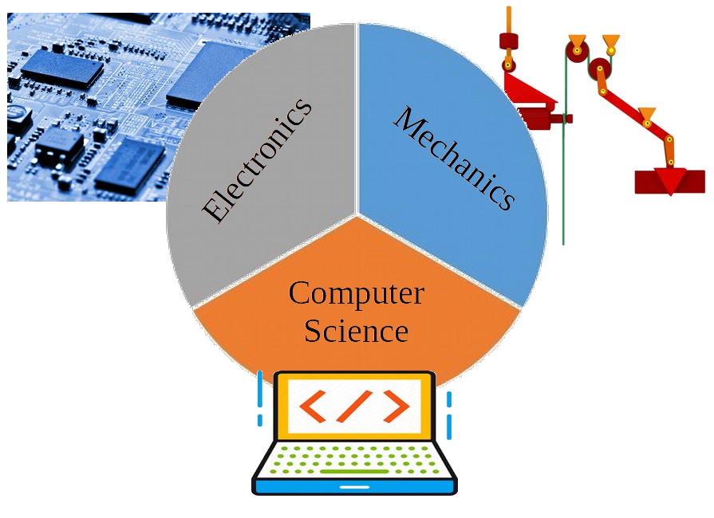

Course Overview
---

Robotics is a multi-disciplinary subject.

In order to get a good grasp of Robotics, you need to understand:
- **Mechanics**: how forces act on objects
- **Electronics**: how electrical circuits work
- **Computer Science**: the mathematics behind computers

These are the foundational theoretical fields related to Robotics.

But in order to make Robots you also need to study their counterpart engineering disciplines:
- **Mechanical Engineering**: how to build machines that use Mechanics to their advantage
- **Electrical Engineering**: how to create circuits that manipulate electrical signals that power our mechanical devices
- **Software Engineering**: how to build algorithms that drive the electrical circuits that power our devices

Each of these disciplines normally requires years of university studies to master.  

This is NOT a University level course.

We are going to get a taste of all of the above, but all of the theory and much of the engineering has already been done for us by LEGO and hidden inside the components of the EV3 Core kit.

If anything, the main discipline we will be studying and exercising is **Systems Engineering**, which looks at best practices for integrating various parts into a working system.

We will be taking a bunch of LEGO recipes and various building blocks of software and building them on top of each other to create a unique final product - a robot!

So, get ready to **build, connect, and code** as we begin our journey into the world of 

<h1>Robotics!</h1>
