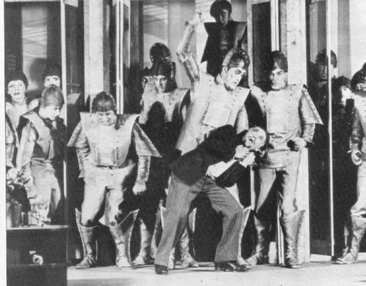

What is a Robot?
---

Take a moment to reflect on the various machines in the illustration above.

Which one would you consider a robot?  Some?  None?  All?

The word **Robot** was coined by the European author and playwright, Karl Capek, in a play about androids (humanoid robots) taking over the world...

The idea comes from a Slavic word that means servitude and drudgery, which is farily apt looking at the way robots are used in industrial automation.

Today, almost anything automated is called a robot, from factory robot arms to driverless cars, from chatbots to other types of software that automate some business or organizational process (bot).

We are going to focus mainly on the class of physical robots that most resemble driverless cars...

As such, our robots will all share some basic electronic & mechanical elements:

- Computer Brain
- Body / Frame
- Motors
- Sensors
- Wires

