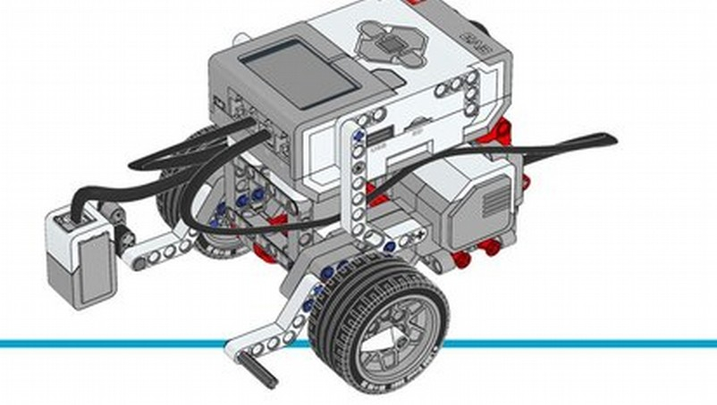

First Build
---

LEGO can seem like a trivial toy, but in fact sometimes it's easier to just glue together some cardboard to achieve similar results that may take hours to build in LEGO.

If this is your first time building an EV3 2-wheel robot, please follow the instructions provided for the EV3 Core Robot Educator:

* It will teach you some useful LEGO assembly techniques
* You will end up with a working 2-wheel robot

While we do want to promote creativity and innovation, in order to get to the next part of our curriculum - using sensors, and creating algorithms - we need a working starting point.

## Instructions

Download instructions [here](download/ev3-rem-driving-base.pdf).

Or:

- Turn on EV3 Classroom 
- Naviagte to *UNITS*
- Download the **Robot Trainer** Plan
- Navigate to *BUILD*
- Click on **Driving Base**

  
   

