The EV3 Brick
---

OK, before we start programming our robot to move, let's just make sure we understand a few things about the EV3 Brick - the brain of our our robot.

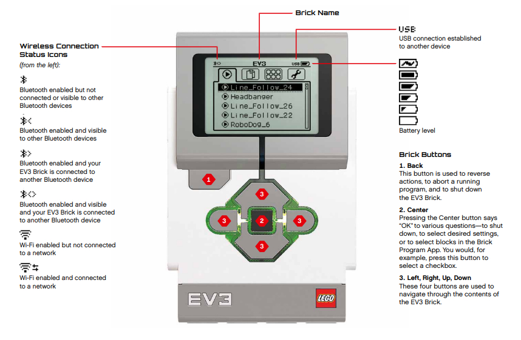

## A-D Motor Ports

On the top of the brick there are 4 ports marked A to D, as well as a USB port marked PC - which is for connecting to brick to your computer if you're not using Bluetooth.  

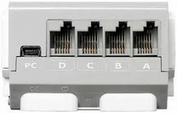

Your two motors should be connected to two of these motor ports, usually A & D, or B & C, but any configuration works...

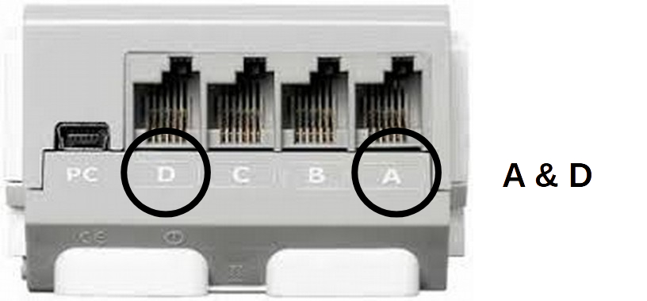

---

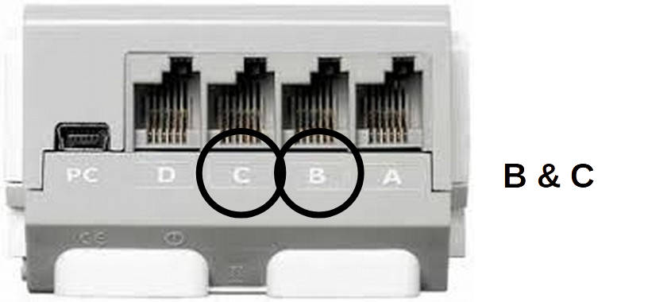

---

Let's assume going forward we are using **A + D ports** for left and right motors.

## Debug Your Robot Build

First, let's power on our EV3 Brick:

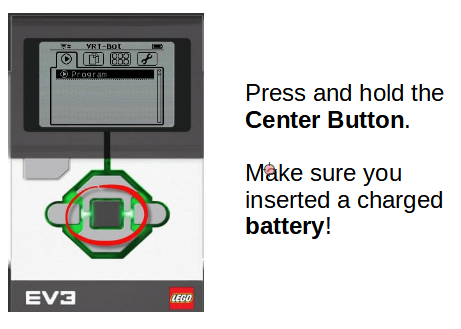

Now let's find the **Motor Control** app:

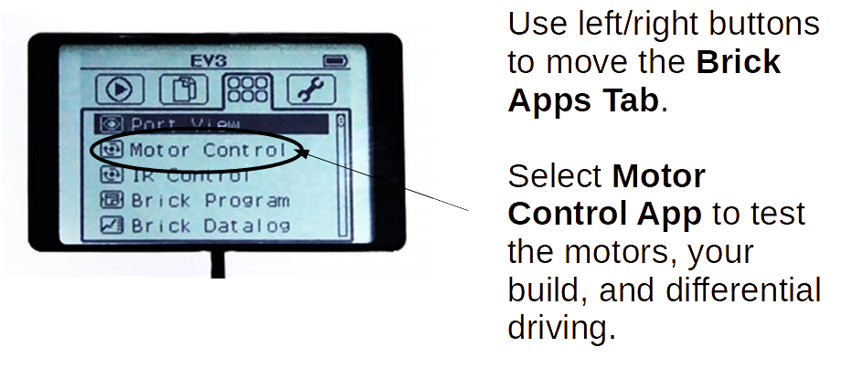

Then, make sure you are controlling the correct ports, you can toggle between B&C or A&D permutations, but as stated above, we are using **A & D Ports** for our examples.

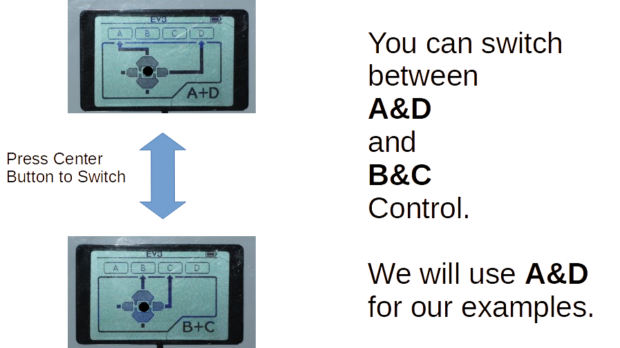

See how different buttons are controlling different motors in different directions.  

Forward or Back on Port A motor.

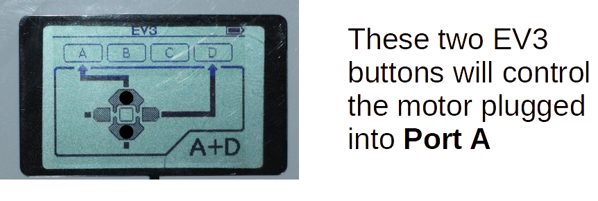

  

Forward or Back on Port D motor.

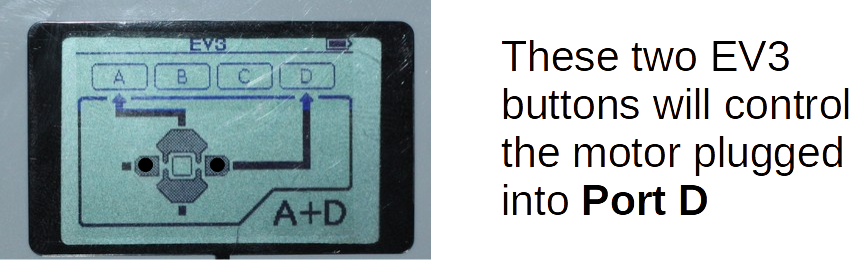

## Test Moving Forward

To move forward both A & D motors need to turn on simultaneously.  The means pressing 2 buttons simultaneously:

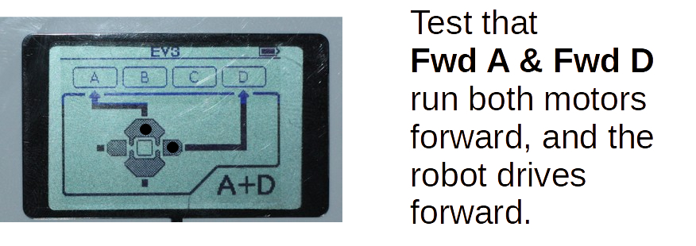

## Test Moving Back

Similarly, to move backwards both A & D motors need to turn on simultaneously in the opposite directions.  The means pressing the other 2 buttons simultaneously:

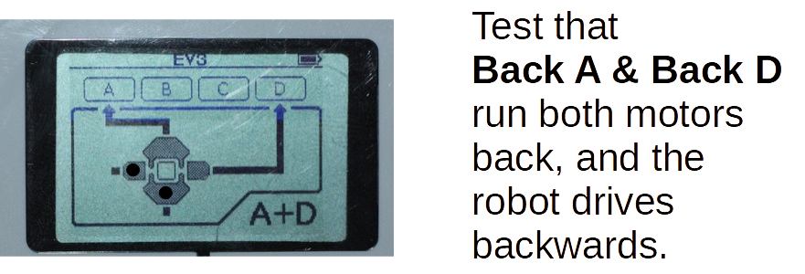

## Test Turning

Finally, to make sure all is in order, just check that the motors can move in opposite directions to one another.  That should cause your robot to turn left or right, depending on which side is attached to which port...

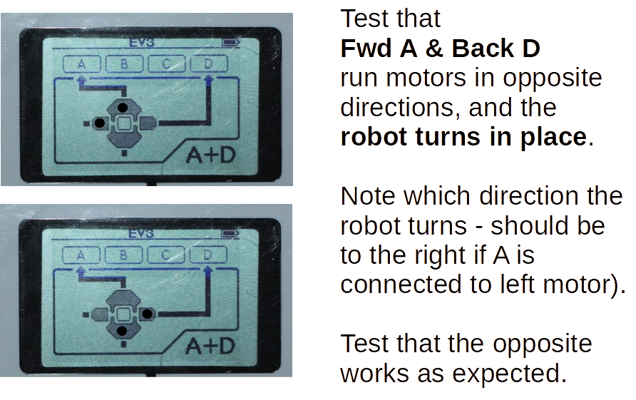

