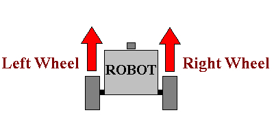

Just Go Straight
---

As we've seen before, to go straight you just need to tell the two wheel motors to move in the same forward direction with the same speed.

So, let's do that now.

## Connect EV3

First, let's connect our brick to our PC, Laptop, or iPad.

If you're using **Bluetooth** best to **rename your Brick** now, so it stands out among the other classroom devices when finding connections.

Make sure the new name appears as shown here:

**Make sure Bluetooth is turned ON!**

## EV3 Classroom

Your PC/Laptop/Tablet should have EV3 Classroom installed on it.
Look for something like this icon:

It might take some time to come up.
 Don't try to start it over and over or it will incapcitate your PC.

Create a **New Project**. 

Click on the small **Connect** button on top.

Follow the instructions to connect...

You will need to enter a Passkey and press enter on the EV3 brick.

## Code

- Under the **Movement** tab, you will find the *move* blocks
- Pick a *move* block and move it to the coding canvas under the *when program starts* block
- Make sure the robot is on a safe surface!!!
- Hit the **Play** button

You may not need to set the Motor ports.  The default motor port setting is B & C.  To explicitly use A & D ports do as above.

## Going Straight?

LEGO robots, like all robots, don't just go straight without some work.  

You can tell both motors to go at the same speed, but the tires may still rotate at different speeds.  

You can use motor encoders to make sure the motor shafts are really rotating at the same speeds, but due to some other mechanical noise (friction, misalignments, assymetrical weight distributions, etc) you will still not see your robot go exactly straight.

The only way to do that is by giving your robot knowlede about what it's doing and the ability to correct any deviations from going straight...