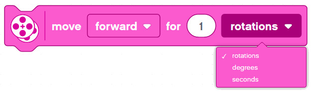

Basic Movement Blocks
---

The following blocks are good to use for some basic sequential programs where you program the robot to drive in a particular path.

Use the blocks below to test your robot's mobility:

1. Drive straight for 1 rotation
1. Drive back for 180 degrees
1. Drive straight for 1 second
1. Make a perfect Right turn
1. Make a perfect Left turn
1. Drive in circles for 5 seconds

## Set Movement Motors

Tell the Brick which 2 Motor ports to use for the Right & Left wheel motors.

The default is B & C.  If you want to use A & D, you better set it properly at the outset of your program. 

## Move Forward/Backward for ...

Use this block to go Forward or Backward only.
The block tries it best to move the two main motors connected at the same speed in the same direction.

- For __ Rotations
    - The amount you enter is the number of times the motor shafts will rotate before coming to a stop.  

- For __ Degrees
    - Similar to Rotations, but with more accuracy, e.g:
    - 360 degrees = 1 rotation
    - 90 degrees = 1/4 of a rotation
    - 540 degrees = 1 and a half rotations
    - and so forth...

- For __ Seconds
    - Keep the motors running for the specified time

## Move with Steering for ...

This block let's you set the direction - so you can steer sideways, not just drive forward and backward.

Same options as above:
- For __ Rotations
- For __ Degrees
- For __ Seconds

## Set Movement Speed

The default speed the above blocks are using is %50.  If you want to go faster you can set the Movement Speed higher.  Similarly, you can also set it lower to make the robot drive even slower.

## Set Movement Motors to Hold/Float at Stop

Say you tell your robot to move Forward for 1 second.

When the 1 second is up, there are various behaviors that could take place:

- **Float**: The power to the motors is cut, but the motor shaft is allowed to rotate freely.  Some momentum will persist and the robot will advance a bit longer before coming to a full rest.

- **Hold Position**: The power to the motors is cut, and the motor shaft is held in place.  Some momentum will persist and the robot may jerk a bit, but the wheels should hold fast.

## (Advanced) For Rotations/Degrees vs. For Seconds

Important: Try to make the robot bump into a wall using for **Rotations** vs. for **Seconds**.  Note the difference:

- For Rotations: program never stops.  The block waits until those number of rotations have completed before moving on to the next code block

- For Seconds: no matter what, the motors will shut off and the program will continue to the next line 

You can test this with a simple program as follows:

In the case of bumping the wall and not being able to rotate as many times as specified, the EV3 should not show the end image.