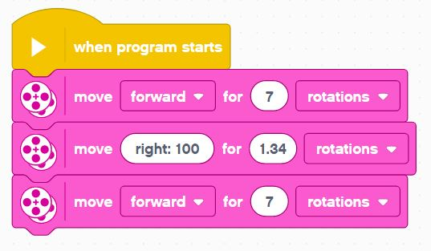
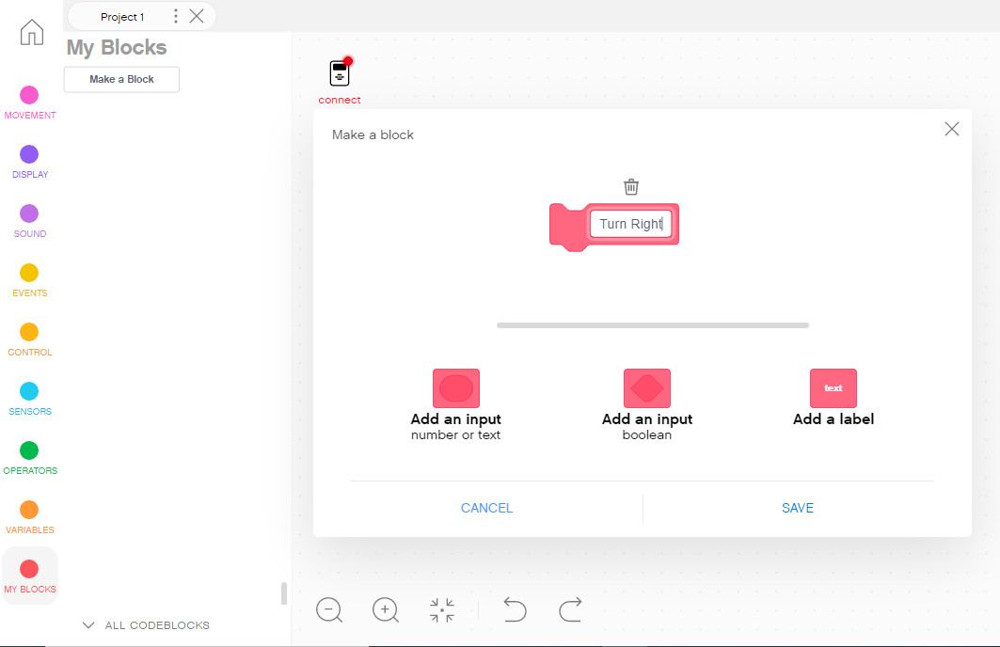
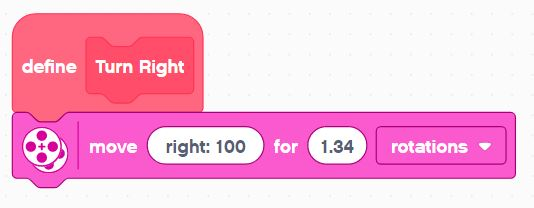
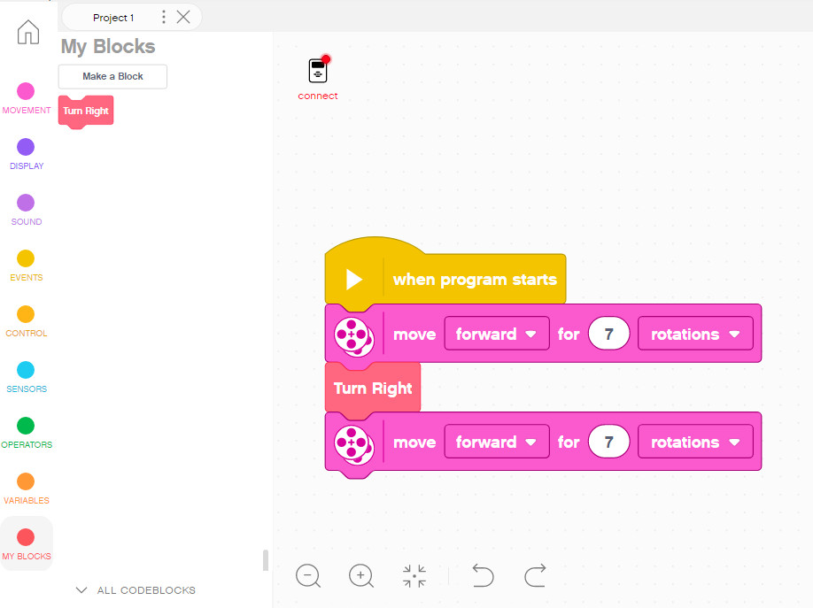
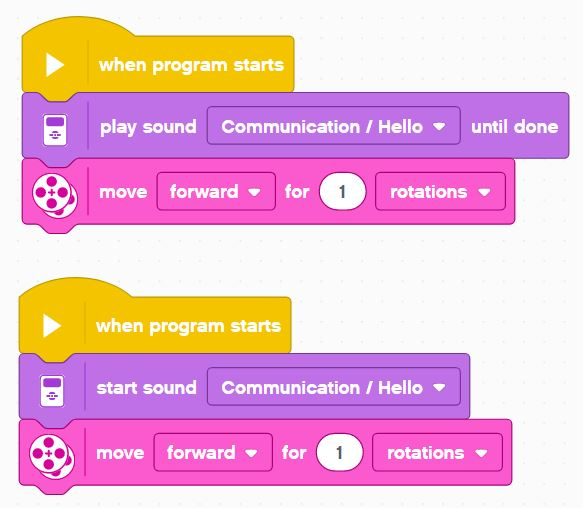

Sequences to Functions
---

## Statement

Each move block in your program is considered a **statement of execution** - these are the building blocks of code.

## Sequence

When you put 1 or more of those statements one after another, your create a coding **Sequence**.

Each statement in the sequence is executed in the order it appears - sequenctially...

## Function

When you have a sequence (even of just 1 statement) that can be abstracted or repeated as a pattern, it is often the best practice to define it as a named **function**.

For instance, one statemnt that makes a perfect 90 degree left turn can be defined as the function **Turn Left**.

Your code will look less messy and you will not need to remember random parameter values like direction values and rotations.

To create a simple function, click the **Make a Block** button in the *My Blocks* tab.

This will create a new function definition stub.

You just need to fill in the definition.

And once you have the function defined you can use it just like any other block in your sequences:

This makes for much better readable and usable code.  

Try to always create functions to make your code better - that's one of the main things that makes a great software engineer great - the ability to abstract code and write easy-to-read programs.

## Blocking vs. Non-Blocking Statements

Most statements have to complete execution before the program moves on to the next one, but sometimes there are statements you can begin and they will continue in the background, while the rest of the sequence continues. 

When a statement holds up the program it's said to be blocking.
And when a statement runs in the background it's said to be non-blocking.

Here is an example of both:

When you play sound **until done**, that statement blocks and the robot will not begin moving until the sound is fully played.

When you simply **start sound**, that statement begins in the background, and the robot will begin moving right away while the sound is played in parallel.
