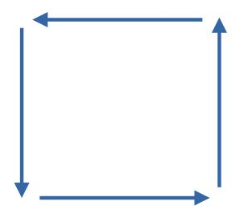
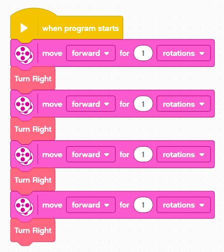
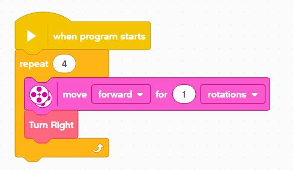
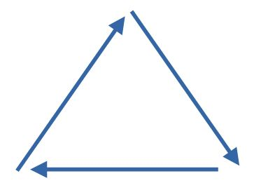
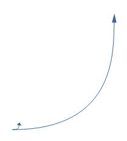
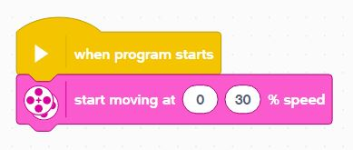

Final Challenges
---

Try some of these challenges with what you've learned:

## Square

Make your robot trace a square shape.

Use Functions to make the code readbale.

## Loops

You should also use loops to avoid repeating code, so this:

Should be rewritten as this:

## Trainagle

Make your robot trace a triangle shape - use functions and loops!

## Small & Big Circles

Make your robot trace the smallest circle possible.

Then, find the largest open area available and make it trace the largest circle.

Use the Tank Move block for this to get a better understanding of your drive system and its capabilities:

The point of this exercise is to understand your potential turn geometry - different turns are useful in different circumstances.
