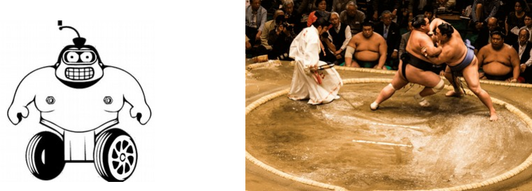
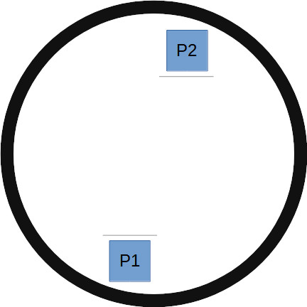
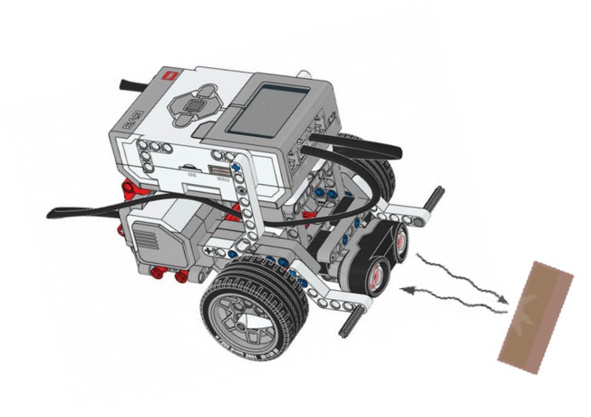

Overview
---

The Sumo challenge is a ubiquitous Robotics event in many national and international competitions.

The basic idea is to design a robot that can push another robot off a round mat.

## Basic Rules

- The arena is usually round and has some colored border
- Robots begin in respective areas around the parameter without any advantage.  The direction they are facing at the start may be randomized.
- First to get knocked out loses
- You can fall off the mat on your own and lose; that's your fault
- There's a time limit; if time runs out without a winner it's considered a tie
- Usually a 1-v-1 face-off will be scored as best out of 3 tries

## Basic Robot Design

- The bare minimum you need as far as electronics is 2 motors and an ultrasonic sensor to detect opponent
- Color sensor would be good to avoid falling off the mat
- In some variations it is allowed to include more actuators to help with the mission

You may get some ideas by looking at some simulation-based Sumo challenges.

<iframe width="853" height="480" src="https://www.youtube.com/embed/qaPpmCzXTP0" title="YouTube video player" frameborder="0" allow="accelerometer; autoplay; clipboard-write; encrypted-media; gyroscope; picture-in-picture" allowfullscreen></iframe>

## Basic Algorithm

In English, the robot should look for opponent, and when it sees it charge at it.  Retreat back if you see you're about to go out of bounds.

In pseudo-code this may look like:

1. If ultrasonic detects opponent go Fwd
1. Else if color sensor sees floor retreat back
1. Else turn around in place...

## Ultrasonic Sensor

Make sure it rides low to see all oppoenents, even the shortest ones...

The detction cone of an ultrasonic sensor is wider the further away it is from the target it is amiming at.  So, when you detect an opponent from far away you may wish to corrcetc for that.

## Color Sensor

Just point it down and make sure it says the border color properly. You can use the sensor dashboard on EV3 classroom, or the Ev3 Snsor view itself.