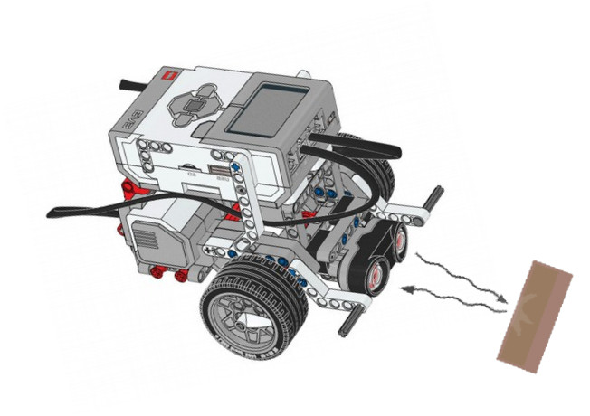

Ultrasonic Sensor
---

## Hardware Details 

The ultrasonic sensor has two elements - a transmitter and a recevier.

The transmitter sends a high-frequency sound wave - ultra meaning well above the human hearing range.
This sound wave bounces off whatever solid matter is in front of the transmitter
The receiver hears the echo.

The sensor on-board CPU is responsible to to track the time it takes between transmitting and hearing the echo.

The faster it comes back, the close the object in front.

## Speed of Sound

Knowing the constant [speed of sound](https://en.wikipedia.org/wiki/Speed_of_sound), and the time it took for the wave to travel, we can measure the distance to the object in the line of "sight".

In general that math is:

*time of signal to return in seconds* x *speed of sound* (meters/second) = *distance signal travelled*

To get the distance to the object we **divide that travel distance by 2**.
Because we only care about one way there, not the whole round trip.

## Test Sensor

You can test the Sensor by attaching it to one of the Sensor Ports (1-4).
Then navigate to **Port View** on the EV3 brick.

You should see some information about the connected ultrasonic sensor.
Try putting your hand in front of it to see the values change and get a sense of what 10cm corresponds to in real life, and so forth.

You should also see the live values supplied by sensor in EV3 Classroom dashboard if your PC is connected to the Ev3.

## Code

To use the ultrasonic sensor, we usually provide a comparison block.  

In the case of Sumo, usually anything short of the MAX Ulrasonic reading (~2.5 meters) means there's an opponent in front.

So, either of these will work in general:

