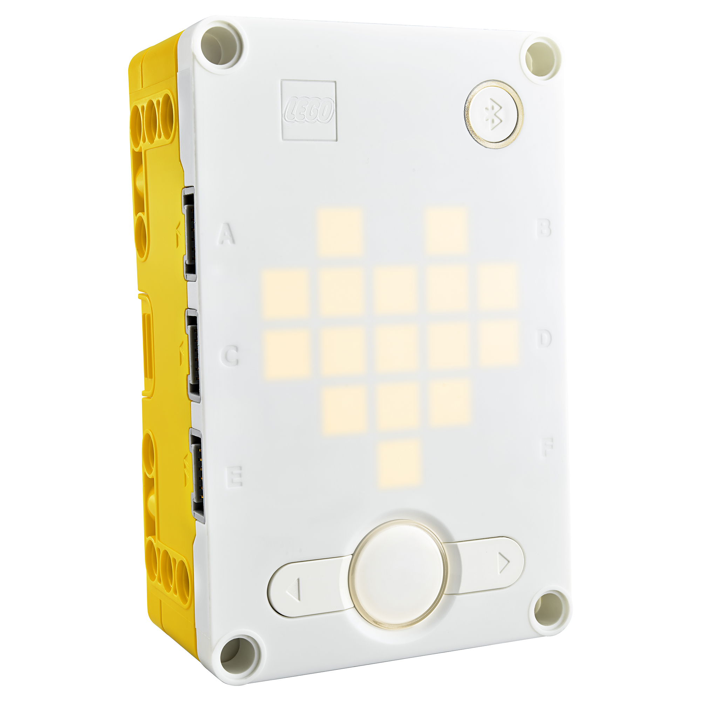
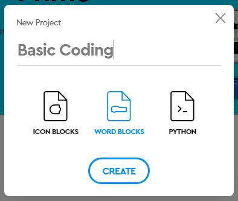
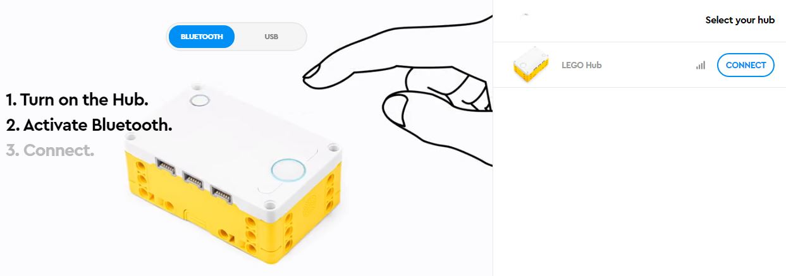
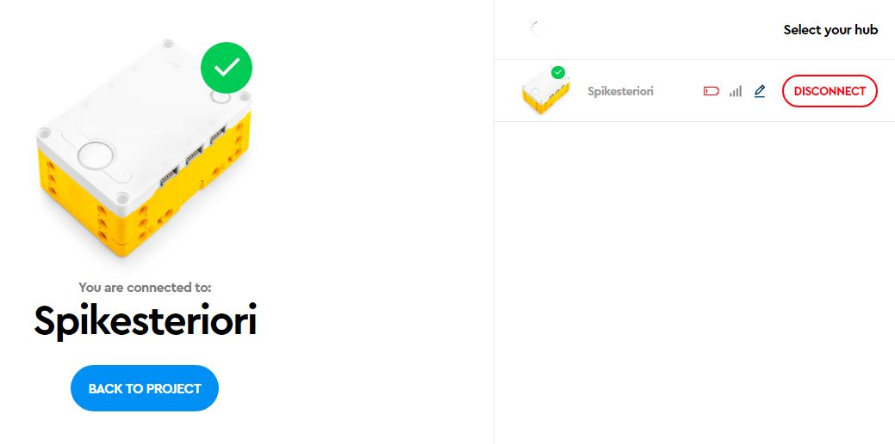

The Spike Hub & App
---

The Spike Prime Hub is the brain of any robot we make.

But we, the programmers, must tell the brain what to think!

The hub contains **six ports** for controling motors and getting information from sensors.  

The hub also has a **5x5 LED matrix** as its display, and a **speaker** that can emit different sounds.

Furthermore, the hub contains an internal **gyro sensor** that can sense the hub's tilt in 3 dimensions.

We will deal with motors and sensors in later parts of this Robotics tutorial, but for now, let's talk about some basic coding using the display and speaker of the hub. 

## Spike App

On your PC/Laptop or Tablet you will need to download the **Spike App** to continue wit this tutorial.

Get the app [here](https://education.lego.com/en-us/downloads/spike-app/software).

### Start a New Project

To begin exploring the capabilities of the Hub and do some basic coding, you will need to start a **New Project [+]**.  

You can give it any name you wish.

Make sure to use **World Blocks**.

## Connect the Hub

There are two ways to connect the hub to your programming device.  

If you are using a laptop you can use either a **USB cable** or **Bluetooth**.  

*Note: If you are using a tablet, you have to use Bluetooth.*

Click the **Connect** button on the top of your new project window and follow instructions.  Make sure your hub is charged or connected to a power source. 

Once the Spike Hub is connected to the Spike App you should see this:

And you can begin coding the project.