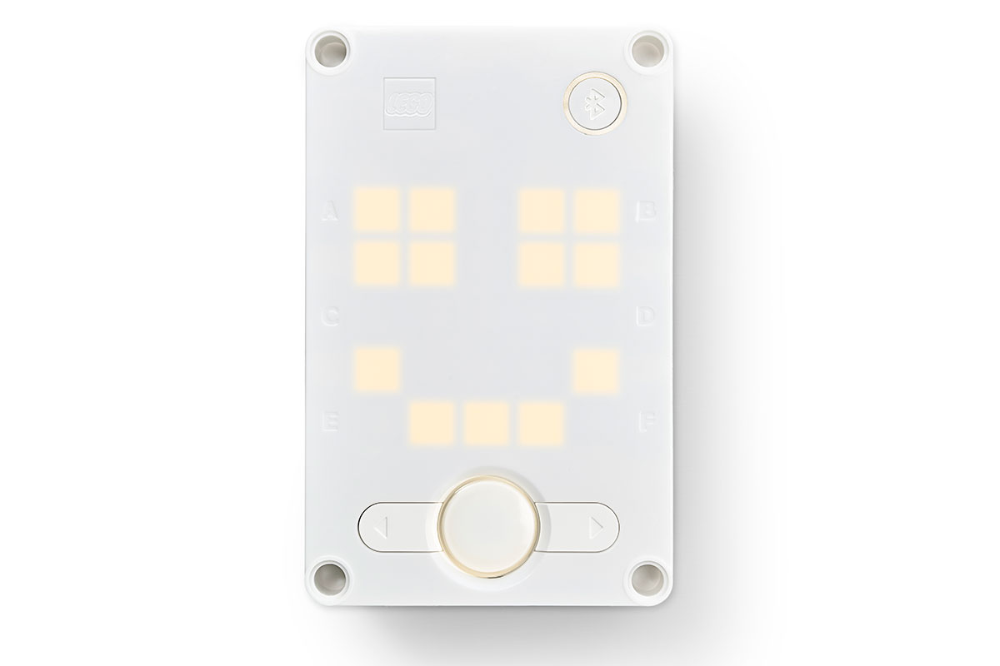
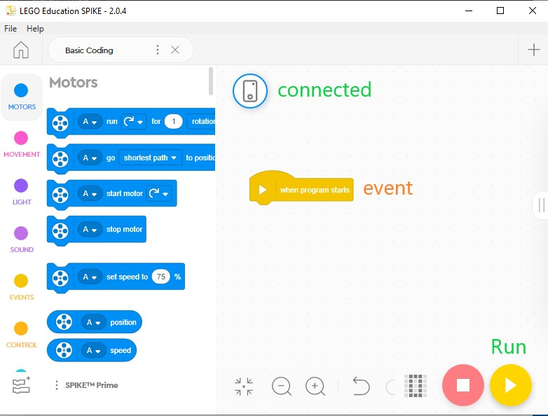
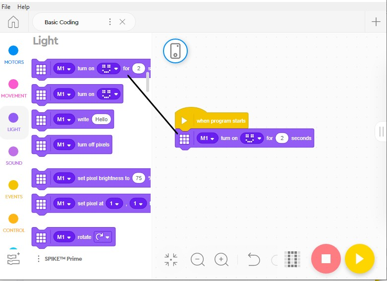
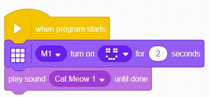
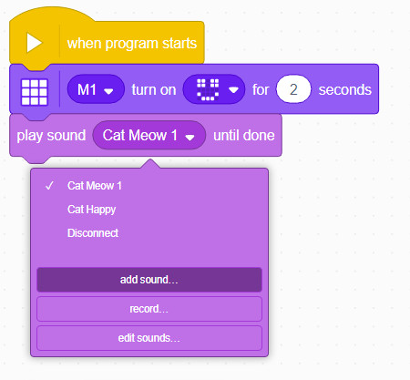

Sequences
---

## Statements

The fundamental unit of a code is an execution **statement**.  

Do this.  

Do that.  

When we program a bunch of these statements one after the other, the hub will execute them in the same order.  

This is called a **sequence**, meaning one statement follows another.

## Sequences

Let's try some simple code sequences.

First, make the Hub display smile.

### Events

When you start a new project, you will see an initial event block **when program starts**.  Any statements attaced to this event will be executed each time the program is initiated.

All event blocks can be found under the **Events** blocks tab.

More on Events later...

### Light

Let's add a statement to make the Hub show a smile face on its LED display.

The LED display is controlled by coding blocks under the **Light** blocks tab.

To add a statement to the when program starts event, you need to find the block you want and **drag it over** the code area with that event block.

Let's drag the *Matrix [] turn on [] for [] seconds* block - the first one in the Light tab - under the *when program starts* event block.

This will make the smiley face show up for 2 seconds.  

Click **Play** button to execute.

### Sound

Let's add another block to make a sound as well.  

The default sound is a cat meow... We don't know why!

You can "Add Sound" to choose from many other library sounds available. 

You can also record and edit sound waves inside the Spike App.  

## Test/Explore

Feel free to explore a bit.

Add different light and sound effects to make a sequence of statements, and test it by running the program on the hub.

Next we will look at how to repeat  statement patterns using Loops.